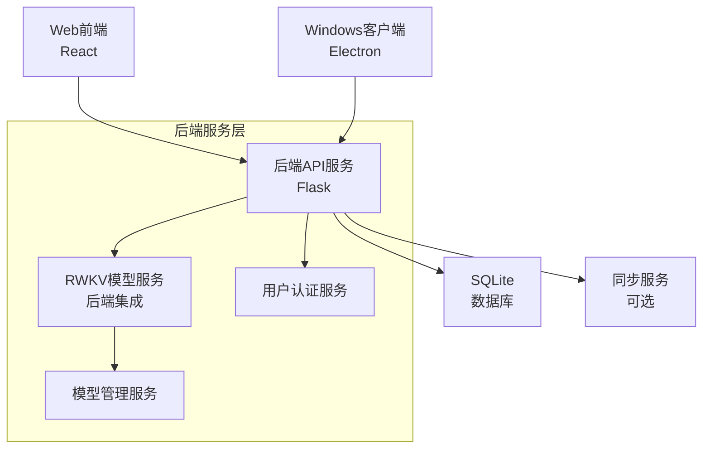

# AI笔记软件 - 总体产品开发手册

> **版本**: v1.0  
> **创建时间**: 2025年8月28日  
> **文档类型**: 产品规划文档  
> **负责人**: JolluChen

## 📋 目录导航

- [产品概述](#产品概述)
- [产品定位与愿景](#产品定位与愿景)
- [核心功能规划](#核心功能规划)
- [技术架构规划](#技术架构规划)
- [开发路线图](#开发路线图)
- [平台规划](#平台规划)
- [风险评估](#风险评估)

## 产品概述

### 产品名称
AI笔记软件 (Notes Application)

### 产品理念
一款真正离线优先的AI笔记软件，为有笔记记录习惯的用户和觉得记笔记整理笔记太麻烦的人提供智能化的笔记管理解决方案。

### 核心价值主张
- **离线优先**: 完全本地化运行，数据隐私安全可控
- **AI智能**: 本地大模型驱动的内容优化和整理
- **多平台**: Web端、Windows桌面端全覆盖
- **实时同步**: 跨设备数据同步，支持冲突解决

## 产品定位与愿景

### 目标用户群体
与Notion用户群体高度重合，但专注于以下细分用户：
1. **有笔记记录习惯的用户**:
   - **技术人员**: 需要记录技术文档、代码笔记的开发者
   - **学生群体**: 有大量学习笔记和资料整理需求的学生
   - **研究人员**: 需要整理研究资料和思路的学者
   - **知识工作者**: 日常工作中需要记录和整理信息的专业人士

2. **觉得记笔记整理笔记太麻烦的人**:
   - 有记录想法的需求但缺乏整理动力的用户
   - 希望AI自动优化文档结构排版的用户
   - 需要AI自动总结和优化内容的用户

### 与竞品对比
与Notion的差异化定位：
- **隐私优先**: 完全本地化，无数据泄露风险
- **AI本地化**: 不依赖第三方AI服务，模型可控
- **离线可用**: 无网络环境下完全可用
- **简化操作**: 专注笔记场景，减少复杂性

## 核心功能规划

### 1. 基础笔记功能
- [x] 块级笔记编辑系统
- [x] **实时自动保存** (已实现block块实时写入数据库)
- [x] 文件夹结构管理
- [ ] 富文本编辑器增强
- [ ] **Mermaid流程图渲染支持** (核心需求)
- [ ] 多种文件格式支持(.md, .txt, .html等)

### 2. AI智能功能
- [x] 基于第三方API的内容优化 (当前实现)
- [ ] **本地RWKV模型集成** (核心功能)
  - [ ] RWKV模型作为后端服务的一部分，启动后一直挂在后台
  - [ ] 通过API与RWKV模型交互，与现有后端同层级
  - [ ] 默认GPU模式运行，无法启动时自动切换到CPU
  - [ ] 用户可手动选择GPU/CPU运行模式
  - [ ] 用户模型导入支持(仅支持RWKV系列.pth, .st格式)
  - [ ] AI开关控制本地模型启停
  - [ ] 模型文件拖拽导入、指定路径导入、路径输入导入
- [ ] **AI内容优化功能** (已在Web端实现)
  - [x] 文档结构自动优化
  - [x] 内容排版自动调整
  - [x] 自动总结生成
  - [x] 语法和清晰度优化
- [ ] 智能标签推荐

### 3. 数据同步功能
- [ ] **账号认证系统**
  - [ ] 用户注册/登录
  - [ ] 权限管理框架
  - [ ] 会话管理
- [ ] **云端同步服务**
  - [ ] 基于用户账号的完全数据同步
  - [ ] 增量数据同步算法
  - [ ] 冲突检测与内容合并解决
  - [ ] 同步设置管理(是否自动同步、同步范围控制)
  - [ ] 离线数据缓存
  - [ ] 用户可选择性同步特定文件夹或笔记

### 4. 协作功能 (后期规划)
- [ ] 多人协作编辑
- [ ] 文件共享机制
- [ ] 权限控制系统
- [ ] 评论与讨论

## 技术架构规划

### 整体架构设计

### 核心技术栈

#### 后端技术
- **Python 3.12+**: 主要开发语言
- **Flask 2.0+**: Web框架
- **SQLAlchemy**: ORM框架
- **SQLite**: 本地数据库
- **RWKV**: 本地AI模型推理

#### 前端技术
- **React 18**: 前端框架
- **Vite**: 构建工具
- **Material-UI**: UI组件库
- **TipTap**: 富文本编辑器
- **DnD Kit**: 拖拽功能

#### 桌面端技术
- **Electron**: 跨平台桌面应用框架
- **React**: 复用Web端界面
- **Node.js**: 运行时环境

## 开发路线图

### 第一阶段 (当前-3个月): 基础功能完善
**目标**: 完善Web端基础功能，启动Windows端开发

**Web端任务**:
- [ ] 完善富文本编辑器
- [ ] 实现Mermaid图表渲染
- [ ] 优化用户界面交互
- [ ] 本地RWKV模型集成

**Windows端任务**:
- [ ] Electron项目搭建
- [ ] 基础界面开发
- [ ] 后端API复用
- [ ] 本地数据库集成

### 第二阶段 (3-6个月): AI功能与同步
**目标**: 实现本地AI模型，开发账号系统和数据同步

**核心任务**:
- [ ] RWKV模型完全本地化(作为后端服务集成)
- [ ] 模型导入功能(拖拽、路径指定、路径输入)
- [ ] GPU/CPU模式选择和自动切换
- [ ] 用户账号认证系统
- [ ] 基于账号的完全数据同步服务
- [ ] 内容合并式冲突解决机制
- [ ] 同步设置管理界面

### 第三阶段 (6-9个月): 协作与优化
**目标**: 实现多人协作功能，性能优化

**核心任务**:
- [ ] 多人协作编辑
- [ ] 实时同步优化
- [ ] 权限管理完善
- [ ] 性能监控与优化
- [ ] 用户体验优化

### 第四阶段 (9-12个月): 生态完善
**目标**: 插件系统，高级功能

**核心任务**:
- [ ] 插件开发框架
- [ ] 第三方集成API
- [ ] 高级AI功能
- [ ] 数据分析与洞察
- [ ] 移动端规划

## 平台规划

### Web端
- **定位**: 主要开发平台和功能原型
- **技术**: React + Flask
- **优势**: 快速迭代，跨平台兼容
- **现状**: 基础功能已实现，需持续完善

### Windows端
- **定位**: 桌面端主力产品
- **技术**: Electron + React (复用Web端)
- **优势**: 深度系统集成，本地文件操作
- **规划**: 与Web端功能保持同步，增加桌面特性

### 移动端 (未来规划)
- **定位**: 轻量级查看和编辑
- **技术**: React Native 或 Flutter
- **优势**: 随时随地访问笔记
- **时间**: 第四阶段考虑启动

## 风险评估

### 技术风险
1. **RWKV模型集成复杂性**
   - 风险等级: 高
   - 缓解措施: 分阶段实现，默认GPU模式，CPU作为备用，建立测试环境
   - 关键点: 模型作为后端服务集成，确保API交互稳定性

2. **跨平台兼容性**
   - 风险等级: 中
   - 缓解措施: 选择成熟的跨平台技术栈

3. **数据同步复杂性**
   - 风险等级: 中
   - 缓解措施: 采用成熟的同步算法，充分测试

### 市场风险
1. **用户接受度**
   - 风险等级: 中
   - 缓解措施: 早期用户反馈，快速迭代

2. **竞品压力**
   - 风险等级: 低
   - 缓解措施: 专注差异化功能，离线优先定位

### 资源风险
1. **开发时间估算**
   - 风险等级: 中
   - 缓解措施: 分阶段交付，MVP优先

## 质量保证

### 代码质量
- 遵循现有的开发规范文档
- 代码审查制度
- 自动化测试覆盖

### 用户体验
- 用户反馈收集机制
- A/B测试框架
- 性能监控系统

---

**备注**: 本文档将根据项目进展和用户反馈持续更新。所有功能开发需要与项目负责人确认后执行。
