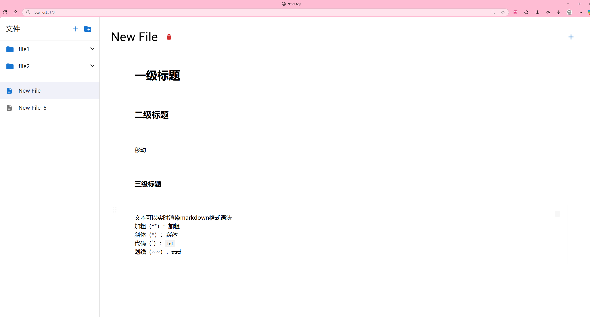

# NotesApplication / 笔记应用

[](https://opensource.org/licenses/Apache-2.0)
[](https://www.python.org/)
[](https://reactjs.org/)
[](https://flask.palletsprojects.com/)
[](https://tiptap.dev/)
[](https://mui.com/)

A modern, intelligent note-taking application built with React frontend and Flask backend, featuring rich text editing with TipTap editor, drag-and-drop sorting, AI-powered content optimization, and comprehensive folder management.<br>
一个现代化的智能笔记应用，采用React前端和Flask后端构建，集成TipTap富文本编辑器，支持拖拽排序、AI内容优化和完整的文件夹管理功能。

## ✨ Features / 功能特性

### Core Features / 核心功能
- **🎨 Rich Text Editing**: Advanced TipTap editor with comprehensive formatting options and Markdown syntax support<br>**🎨 富文本编辑**: 高级TipTap编辑器，支持全面的格式化选项和Markdown语法
- **🔄 Drag & Drop Sorting**: Intuitive @dnd-kit implementation for seamless note organization<br>**🔄 拖拽排序**: 直观的@dnd-kit实现，无缝的笔记组织体验
- **💾 Real-time Saving**: Automatic note persistence with intelligent debounce optimization<br>**💾 实时保存**: 自动笔记持久化，智能防抖优化
- **📝 Multiple Note Formats**: Support for text, headings, lists, quotes, code blocks, and links<br>**📝 多种笔记格式**: 支持文本、标题、列表、引用、代码块和链接
- **📁 Folder Management**: Complete folder hierarchy with create, rename, and delete operations<br>**📁 文件夹管理**: 完整的文件夹层次结构，支持创建、重命名和删除操作
- **🤖 AI-Powered Optimization**: Intelligent content enhancement using LangChain and Qwen AI<br>**🤖 AI智能优化**: 使用LangChain和通义千问AI进行智能内容增强
- **🎯 Context Menu**: Right-click functionality for quick format conversion and operations<br>**🎯 右键菜单**: 右键功能，快速格式转换和操作
- **📱 Responsive Design**: Material-UI components ensuring excellent user experience across devices<br>**📱 响应式设计**: Material-UI组件确保跨设备的优秀用户体验
- **🔗 RESTful API**: Clean, well-documented API design for seamless frontend-backend communication<br>**🔗 RESTful API**: 清晰、文档完善的API设计，实现前后端无缝通信

### Technical Features / 技术特性
- **🚀 Modern Tech Stack**: React 18.2 + Flask 2.0 + SQLite with Python 3.12<br>**🚀 现代技术栈**: React 18.2 + Flask 2.0 + SQLite，基于Python 3.12
- **🏗️ Component Architecture**: Modular React components with custom hooks and error boundaries<br>**🏗️ 组件架构**: 模块化React组件配合自定义钩子和错误边界
- **⚡ State Management**: Advanced React Hooks pattern with optimized re-rendering<br>**⚡ 状态管理**: 高级React Hooks模式，优化重渲染性能
- **🎯 Performance Optimization**: Debounced input, lazy loading, and intelligent caching<br>**🎯 性能优化**: 防抖输入、懒加载和智能缓存机制
- **🛡️ Error Handling**: Comprehensive error boundaries, API status monitoring, and user feedback<br>**🛡️ 错误处理**: 全面的错误边界、API状态监控和用户反馈
- **🐳 Docker Support**: Full containerization with multi-stage builds and Docker Compose<br>**🐳 Docker支持**: 完整容器化，多阶段构建和Docker Compose
- **🔧 Development Tools**: Hot reload, code standards checker, and automated documentation sync<br>**🔧 开发工具**: 热重载、代码规范检查器和自动化文档同步
- **📊 AI Integration**: LangChain framework with Qwen LLM for content optimization<br>**📊 AI集成**: LangChain框架集成通义千问大模型进行内容优化
- **🎨 UI/UX Excellence**: Material-UI design system with consistent theming<br>**🎨 UI/UX卓越**: Material-UI设计系统，一致的主题化设计

## 🚀 Quick Start / 快速开始

### Prerequisites / 前置要求

- **Python 3.12+** (Backend runtime / 后端运行环境)
- **Node.js 18+** (Frontend build tool / 前端构建工具)
- **npm or yarn** (Package manager / 包管理器)
- **Docker & Docker Compose** (Optional, for containerized deployment / 可选，用于容器化部署)

### Installation / 安装

#### Method 1: Docker Deployment (Recommended) / 方法1: Docker部署（推荐）

1. Clone the repository:<br>克隆仓库：
```bash
git clone https://github.com/yourusername/NotesApplication.git
cd NotesApplication
```

2. Configure environment variables:<br>配置环境变量：
```bash
# Copy environment template
cp frontend/.env.example frontend/.env.development

# Edit configuration as needed
# 根据需要编辑配置
```

3. Start with Docker Compose:<br>使用Docker Compose启动：
```bash
docker-compose up -d
```

Application will be available at:<br>应用将在以下地址可用：
- **Frontend**: http://localhost:3000<br>**前端**: http://localhost:3000
- **Backend API**: http://localhost:5000<br>**后端API**: http://localhost:5000
- **Health Check**: http://localhost:5000/api/health<br>**健康检查**: http://localhost:5000/api/health

#### Method 2: Local Development / 方法2: 本地开发

1. Clone and setup backend:<br>克隆并设置后端：
```bash
git clone https://github.com/yourusername/NotesApplication.git
cd NotesApplication

# Create virtual environment
python -m venv venv
source venv/bin/activate  # On Windows: venv\Scripts\activate

# Install dependencies
pip install -r requirements.txt

# Initialize database
flask db upgrade

# Start backend server
python app.py
```

2. Setup frontend in a new terminal:<br>在新终端中设置前端：
```bash
cd frontend

# Install dependencies
npm install

# Start development server
npm run dev
```

Application will start at **http://localhost:5173**<br>应用将在 **http://localhost:5173** 启动

### AI Configuration / AI配置

To enable AI-powered content optimization, configure your API keys:<br>要启用AI内容优化功能，请配置您的API密钥：

```bash
# Create .env file in project root
# 在项目根目录创建.env文件
echo "DASHSCOPE_API_KEY=your_qwen_api_key_here" > .env
echo "OPENAI_API_KEY=your_openai_api_key_here" >> .env
```

## 📖 Documentation / 文档

### Core Documentation / 核心文档
- [🇺🇸 English Documentation](docs/README_EN.md)
- [🇨🇳 中文文档](docs/README_CN.md)
- [🏗️ Project Architecture](docs/PROJECT_ARCHITECTURE_CN.md)
- [📋 Development Standards](docs/DEVELOPMENT_STANDARDS.md)

### Deployment Guides / 部署指南
- [🐳 Docker Deployment](docs/DOCKER_DEPLOY.md)
- [🐧 Ubuntu Deployment](docs/DEPLOY_UBUNTU.md)

### Development Resources / 开发资源
- [🔧 Git Operations](docs/git-operations.md)
- [🐛 Error Solutions](docs/ERROR_LOG.md)
- [📝 Change Log](docs/CHANGELOG.md)
- [🚧 Unfinished Features](docs/Unfinished_Features.md)

## 🛠️ Tech Stack / 技术栈

### Frontend / 前端
- **React 18.2.0** - Modern UI library with hooks<br>现代UI库，支持hooks
- **Vite 6.3.4** - Lightning-fast build tool and dev server<br>超快构建工具和开发服务器
- **Material-UI 5.13.0** - Comprehensive React component library<br>全面的React组件库
- **TipTap 2.4.0** - Extensible rich text editor framework<br>可扩展的富文本编辑器框架
- **@dnd-kit 6.3.1** - Modern drag and drop toolkit<br>现代拖拽工具包
- **@emotion** - CSS-in-JS styling solution<br>CSS-in-JS样式解决方案
- **Axios 1.4.0** - Promise-based HTTP client<br>基于Promise的HTTP客户端
- **React Markdown 8.0.7** - Markdown rendering component<br>Markdown渲染组件

### Backend / 后端
- **Python 3.12** - Modern Python runtime<br>现代Python运行时
- **Flask 2.0.1** - Lightweight WSGI web framework<br>轻量级WSGI网络框架
- **SQLAlchemy 1.4.23** - Python SQL toolkit and ORM<br>Python SQL工具包和ORM
- **SQLite** - Embedded relational database<br>嵌入式关系数据库
- **Flask-CORS 3.0.10** - Cross-origin resource sharing<br>跨源资源共享
- **Flask-Migrate 3.1.0** - Database schema migrations<br>数据库模式迁移
- **LangChain 0.3.0+** - AI/LLM integration framework<br>AI/LLM集成框架
- **Qwen (通义千问)** - Large language model for content optimization<br>用于内容优化的大语言模型

### Development & Deployment / 开发与部署
- **Docker & Docker Compose** - Containerization and orchestration<br>容器化和编排
- **Nginx** - High-performance web server (production)<br>高性能网络服务器（生产环境）
- **Git** - Distributed version control system<br>分布式版本控制系统
- **Vite HMR** - Hot module replacement for development<br>开发热模块替换
- **Python Virtual Environment** - Isolated Python dependencies<br>隔离的Python依赖环境

## Usage Guide / 使用说明

### Basic Operations / 基本操作
1. **📝 Create Note**: Click the "+" button in the sidebar or use keyboard shortcut <br> **📝 创建笔记**：点击侧边栏的"+"按钮或使用键盘快捷键
2. **✏️ Edit Note**: Click on any note to start editing with rich text support <br> **✏️ 编辑笔记**：点击任意笔记开始编辑，支持富文本
3. **📁 Folder Management**: Create, rename, and organize notes in folders <br> **📁 文件夹管理**：创建、重命名和组织笔记文件夹
4. **🔄 Drag & Sort**: Use the drag handle (⋮⋮) to reorder notes intuitively <br> **🔄 拖拽排序**：使用拖拽手柄（⋮⋮）直观地重新排序笔记
5. **🗑️ Delete**: Right-click for context menu or use the delete button <br> **🗑️ 删除**：右键打开上下文菜单或使用删除按钮

### Advanced Features / 高级功能
6. **🎨 Rich Formatting**: Use toolbar or Markdown syntax for text formatting <br> **🎨 富文本格式**：使用工具栏或Markdown语法进行文本格式化
7. **🤖 AI Optimization**: Right-click and select "AI Optimize" for content enhancement <br> **🤖 AI优化**：右键选择"AI优化"进行内容增强
8. **📋 Format Conversion**: Convert between different note formats via context menu <br> **📋 格式转换**：通过上下文菜单在不同笔记格式间转换
9. **💾 Auto-Save**: Notes are automatically saved as you type <br> **💾 自动保存**：输入时笔记自动保存
10. **🔍 Quick Access**: Recently edited notes appear at the top <br> **🔍 快速访问**：最近编辑的笔记显示在顶部

## Development Features / 开发特性

### Architecture & Design / 架构与设计
- **🏗️ Modular Architecture**: Clean separation of concerns with custom hooks <br> **🏗️ 模块化架构**：清晰的关注点分离，自定义钩子
- **🎯 Component-Based**: Reusable React components with consistent API <br> **🎯 组件化设计**：可复用的React组件，一致的API
- **🔄 State Management**: Advanced React Hooks pattern with context optimization <br> **🔄 状态管理**：高级React Hooks模式，上下文优化
- **🛡️ Error Boundaries**: Comprehensive error handling and user feedback <br> **🛡️ 错误边界**：全面的错误处理和用户反馈
- **📱 Responsive Design**: Mobile-first approach with Material-UI breakpoints <br> **📱 响应式设计**：移动优先方法，Material-UI断点

### Performance & Optimization / 性能与优化
- **⚡ Debounced Input**: Optimized typing experience with intelligent delays <br> **⚡ 防抖输入**：智能延迟优化的输入体验
- **🚀 Lazy Loading**: Dynamic component loading for better performance <br> **🚀 懒加载**：动态组件加载提升性能
- **💾 Smart Caching**: Efficient data fetching and state synchronization <br> **💾 智能缓存**：高效的数据获取和状态同步
- **🔄 Hot Reload**: Instant development feedback with Vite HMR <br> **🔄 热重载**：Vite HMR即时开发反馈
- **📊 Bundle Optimization**: Tree-shaking and code splitting <br> **📊 包优化**：Tree-shaking和代码分割

### API & Data / API与数据
- **🔗 RESTful API**: Clean, documented endpoints with proper HTTP methods <br> **🔗 RESTful API**：清晰、文档化的端点，正确的HTTP方法
- **💾 SQLite Persistence**: Reliable local data storage with migrations <br> **💾 SQLite持久化**：可靠的本地数据存储，支持迁移
- **🔄 Real-time Sync**: Automatic note saving with conflict resolution <br> **🔄 实时同步**：自动笔记保存，冲突解决
- **🤖 AI Integration**: LangChain-powered content optimization <br> **🤖 AI集成**：LangChain驱动的内容优化
- **📡 Health Monitoring**: API status checking and error recovery <br> **📡 健康监控**：API状态检查和错误恢复

## Project Structure / 项目结构

```
NotesApplication/
├── 📄 .dockerignore          # Docker ignore configuration / Docker忽略配置
├── 📄 .gitignore             # Git ignore configuration / Git忽略配置
├── 🐳 Dockerfile             # Docker configuration for backend / 后端Docker配置文件
├── 📜 LICENSE                # Apache 2.0 license file / Apache 2.0许可证文件
├── 📖 README.md              # Project main documentation (this file) / 项目主文档 (本文档)
├── 🚀 app.py                 # Flask backend application entry / Flask后端应用入口
├── 🐳 docker-compose.yml     # Docker Compose configuration / Docker Compose配置文件
├── 📦 package-lock.json      # Node.js lock file for root tools / 根目录工具Node.js锁定文件
├── 📦 package.json           # Node.js dependencies for development tools / 开发工具Node.js依赖
├── 📋 requirements.txt       # Python dependencies / Python依赖
├── 🏗️ app/                   # Backend application main directory / 后端应用主目录
│   ├── 🔧 __init__.py        # Package initialization and app factory / 包初始化和应用工厂
│   ├── 🌐 api/               # API routes module / API路由模块
│   │   ├── 🔧 __init__.py    # Routes package initialization / 路由包初始化
│   │   ├── 📁 files.py       # File management routes / 文件管理路由
│   │   ├── 📂 folders.py     # Folder management routes / 文件夹管理路由
│   │   ├── ❤️ health.py      # Health check routes / 健康检查路由
│   │   └── 📝 notes.py       # Note CRUD routes / 笔记CRUD路由
│   ├── ⚙️ config/            # Configuration module / 配置模块
│   │   ├── 🔧 __init__.py    # Config package initialization / 配置包初始化
│   │   └── ⚙️ config.py      # Configuration definitions / 配置定义
│   ├── 🔌 extensions.py      # Flask extensions instantiation / Flask扩展实例化
│   ├── 🗄️ models/            # Database models / 数据库模型
│   │   ├── 🔧 __init__.py    # Models package initialization / 模型包初始化
│   │   ├── 📂 folder.py      # Folder model / 文件夹模型
│   │   ├── 📝 note.py        # Note model / 笔记模型
│   │   └── 📄 note_file.py   # Note file model / 笔记文件模型
│   ├── 🔧 services/          # Business logic services / 业务逻辑服务
│   │   ├── 🔧 __init__.py    # Services package initialization / 服务包初始化
│   │   └── 🤖 ai_service.py  # AI optimization service / AI优化服务
│   └── 🛠️ utils/             # Utility functions / 工具函数
│       └── 🔧 __init__.py    # Utils package initialization / 工具包初始化
├── 📚 docs/                  # Documentation directory / 文档目录
│   ├── 📝 CHANGELOG.md       # Bilingual changelog / 双语更新日志
│   ├── 🐧 DEPLOY_UBUNTU.md   # Ubuntu deployment guide / Ubuntu部署指南
│   ├── 📋 DEVELOPMENT_STANDARDS.md # Development standards / 开发标准
│   ├── 🐳 DOCKER_DEPLOY.md   # Docker deployment guide / Docker部署指南
│   ├── 🐛 ERROR_LOG.md       # Error logging and solutions / 错误日志与解决方案
│   ├── 🏗️ PROJECT_ARCHITECTURE_CN.md # Project architecture / 项目架构
│   ├── 🇨🇳 README_CN.md       # Chinese README / 中文README
│   ├── 🇺🇸 README_EN.md       # English README / 英文README
│   ├── 🚧 Unfinished_Features.md # Unfinished features list / 未完成功能清单
│   └── 🔀 git-operations.md  # Git operation guide / Git操作指南
├── 🖼️ figs/                  # Figures and screenshots / 图片和截图
│   └── 🖥️ WebUI.png          # Web interface screenshot / Web界面截图
├── 🎨 frontend/              # Frontend application (React + Vite) / 前端应用 (React + Vite)
│   ├── 🔧 .env.development   # Development environment variables / 开发环境变量
│   ├── 📄 .env.example       # Environment variables template / 环境变量模板
│   ├── 🔧 .env.production    # Production environment variables / 生产环境变量
│   ├── 🐳 Dockerfile         # Docker configuration for frontend / 前端Docker配置文件
│   ├── 🌐 index.html         # HTML entry point / HTML入口文件
│   ├── 🌐 nginx.conf         # Nginx configuration for Docker deployment / Docker部署Nginx配置
│   ├── 📦 package-lock.json  # Node.js lock file / Node.js锁定文件
│   ├── 📦 package.json       # Node.js dependencies / Node.js依赖
│   ├── ⚡ vite.config.js     # Vite configuration / Vite配置文件
│   └── 💻 src/               # Source code / 源代码
│       ├── 🚀 App.jsx        # Main application component / 主应用组件
│       ├── 🧩 components/    # Reusable UI components / 可复用UI组件
│       │   ├── 🤖 AIOptimizeDialog.jsx # AI optimization dialog / AI优化对话框
│       │   ├── 📱 AppHeader.jsx # Application header / 应用头部
│       │   ├── 🛡️ ErrorBoundary.jsx # Error boundary component / 错误边界组件
│       │   ├── 📝 NoteList.jsx # Note list with drag & drop / 笔记列表（拖拽功能）
│       │   └── 📂 Sidebar.jsx # Navigation sidebar / 导航侧边栏
│       ├── 🎣 hooks/         # Custom React hooks / 自定义React钩子
│       │   ├── 🔌 useApiStatus.js # API status monitoring / API状态监控
│       │   ├── 📁 useFiles.js # File management hook / 文件管理钩子
│       │   ├── 📂 useFolders.js # Folder management hook / 文件夹管理钩子
│       │   └── 📝 useNotes.js # Note management hook / 笔记管理钩子
│       ├── 🎨 index.css      # Global styles / 全局样式
│       ├── 🚀 main.jsx       # Application entry point / 应用入口文件
│       ├── 🌐 services/      # API interaction services / API交互服务
│       │   └── 🔗 api.js     # API client configuration / API客户端配置
│       └── 🛠️ utils/         # Utility functions / 工具函数
│           ├── 🔄 dndWrapper.jsx # Drag & drop utilities / 拖拽工具
│           └── 🎯 dnd/       # DnD kit components / DnD kit组件
├── 🧪 tests/                 # Test files / 测试文件
│   └── 🧪 test_app.py        # Backend application tests / 后端应用测试
└── 🔧 tools/                 # Utility scripts / 工具脚本
    ├── ✅ code_standards_checker.py # Code standards checker / 代码标准检查器
    └── 🔄 sync_docs.py       # Documentation sync script / 文档同步脚本
```

**Generated Files (Git Ignored) / 生成文件（Git忽略）:**
- `📄 notes.db` - SQLite database file / SQLite数据库文件
- `📋 app_debug.log` - Application debug logs / 应用调试日志
- `📁 node_modules/` - Node.js dependencies / Node.js依赖
- `📁 __pycache__/` - Python bytecode cache / Python字节码缓存

## Development Plans / 开发计划

### ✅ Completed Features / 已完成功能

#### Core Functionality / 核心功能
- [x] **Rich Text Editor**: TipTap integration with comprehensive formatting<br>[x] **富文本编辑器**：TipTap集成，全面格式化支持
- [x] **Drag & Drop Sorting**: @dnd-kit implementation for intuitive organization<br>[x] **拖拽排序**：@dnd-kit实现直观组织
- [x] **Folder Management**: Complete CRUD operations for note organization<br>[x] **文件夹管理**：完整的CRUD操作
- [x] **AI Content Optimization**: LangChain + Qwen integration<br>[x] **AI内容优化**：LangChain + 通义千问集成
- [x] **Real-time Auto-save**: Debounced saving with conflict resolution<br>[x] **实时自动保存**：防抖保存，冲突解决
- [x] **Multiple Note Formats**: Text, headings, lists, quotes, code blocks<br>[x] **多种笔记格式**：文本、标题、列表、引用、代码块
- [x] **Context Menu**: Right-click operations for quick actions<br>[x] **右键菜单**：快速操作的右键功能
- [x] **Error Handling**: Comprehensive error boundaries and user feedback<br>[x] **错误处理**：全面的错误边界和用户反馈
- [x] **Responsive Design**: Mobile-optimized Material-UI interface<br>[x] **响应式设计**：移动优化的Material-UI界面

#### Technical Improvements / 技术改进
- [x] **Performance Optimization**: Debounced input and efficient re-rendering<br>**性能优化**：防抖输入和高效重渲染
- [x] **Code Standards**: Development standards documentation and checker<br>**代码标准**：开发标准文档和检查器
- [x] **Docker Support**: Multi-stage builds and production deployment<br>**Docker支持**：多阶段构建和生产部署
- [x] **API Health Monitoring**: Status checking and error recovery<br>**API健康监控**：状态检查和错误恢复

### 🚧 In Progress / 进行中

- [ ] **Enhanced AI Features**: More optimization types and content suggestions<br>**增强AI功能**：更多优化类型和内容建议
- [ ] **Performance Monitoring**: Real-time performance metrics and optimization<br>**性能监控**：实时性能指标和优化
- [ ] **Advanced Search**: Full-text search with filters and sorting<br>**高级搜索**：带过滤器和排序的全文搜索

### 🎯 Planned Features / 计划功能

#### Short-term (Next 2-4 weeks) / 短期（未来2-4周）
- [ ] **🔍 Search Functionality**: Full-text search across notes and folders<br>**🔍 搜索功能**：跨笔记和文件夹的全文搜索
- [ ] **🏷️ Tags System**: Note tagging and category management<br>**🏷️ 标签系统**：笔记标签和分类管理
- [ ] **🌙 Dark Mode**: Complete dark theme implementation<br>**🌙 深色模式**：完整的深色主题实现
- [ ] **📱 Mobile App**: React Native mobile application<br>**📱 移动应用**：React Native移动应用程序
- [ ] **🔄 Sync Service**: Cloud synchronization capabilities<br>**🔄 同步服务**：云同步功能

#### Medium-term (Next 1-3 months) / 中期（未来1-3个月）
- [ ] **👤 User Authentication**: Multi-user support with secure login<br>**👤 用户认证**：多用户支持和安全登录
- [ ] **🖼️ Image Support**: Upload, resize, and manage images in notes<br>**🖼️ 图片支持**：在笔记中上传、调整大小和管理图片
- [ ] **📤 Export/Import**: Multiple format support (PDF, Word, Markdown)<br>**📤 导入导出**：多格式支持（PDF、Word、Markdown）
- [ ] **🔗 Note Linking**: Internal linking between notes<br>**🔗 笔记链接**：笔记间的内部链接
- [ ] **📊 Analytics**: Usage statistics and insights<br>**📊 分析功能**：使用统计和洞察

#### Long-term (3+ months) / 长期（3个月以上）
- [ ] **🤝 Collaboration**: Real-time collaborative editing<br>**🤝 协作功能**：实时协作编辑
- [ ] **🔌 Plugin System**: Extensible architecture for third-party plugins<br>**🔌 插件系统**：第三方插件的可扩展架构
- [ ] **📱 PWA Support**: Progressive Web App capabilities<br>**📱 PWA支持**：渐进式Web应用功能
- [ ] **🌐 Multi-language**: Internationalization support<br>**🌐 多语言**：国际化支持
- [ ] **🔒 Advanced Security**: End-to-end encryption for sensitive notes<br>**🔒 高级安全**：敏感笔记的端到端加密


## 🚀 Performance & Monitoring / 性能与监控

### Performance Features / 性能特性
- **⚡ Fast Startup**: Vite's lightning-fast development server <br> **⚡ 快速启动**：Vite的闪电般快速开发服务器
- **🔄 Hot Module Replacement**: Instant updates during development <br> **🔄 热模块替换**：开发期间即时更新
- **📦 Optimized Builds**: Tree-shaking and code splitting for production <br> **📦 优化构建**：生产环境的Tree-shaking和代码分割
- **💾 Smart Caching**: Efficient API response caching and state management <br> **💾 智能缓存**：高效的API响应缓存和状态管理
- **🎯 Debounced Operations**: Optimized user input handling <br> **🎯 防抖操作**：优化的用户输入处理

### Monitoring / 监控
- **❤️ Health Checks**: Built-in API health monitoring <br> **❤️ 健康检查**：内置API健康监控
- **🐛 Error Tracking**: Comprehensive error boundaries and logging <br> **🐛 错误跟踪**：全面的错误边界和日志记录
- **📊 Performance Metrics**: Real-time performance monitoring (planned) <br> **📊 性能指标**：实时性能监控（计划中）
- **🔍 Debug Tools**: Development debugging utilities <br> **🔍 调试工具**：开发调试实用程序

## 🔧 Development Tools / 开发工具

#### Code Quality / 代码质量
```bash
# Run code standards checker
# 运行代码标准检查器
python tools/code_standards_checker.py

# Sync documentation
# 同步文档
python tools/sync_docs.py
```

#### Testing / 测试
```bash
# Run backend tests
# 运行后端测试
python -m pytest tests/

# Run frontend tests (if configured)
# 运行前端测试（如果已配置）
cd frontend
npm test
```

#### External Access for Testing / 测试外网访问
```bash
# Install and use ngrok for external testing
# 安装并使用ngrok进行外网测试
npm install -g ngrok

# Expose frontend
ngrok http 5173

# Expose backend API
ngrok http 5000
```

### 🌐 External Access Configuration / 外网访问配置

#### Development Environment / 开发环境

For external access during development, you can use ngrok or similar tools:<br>开发期间的外网访问，可以使用ngrok或类似工具：

```bash
# Install ngrok globally
# 全局安装ngrok
npm install -g ngrok

# Expose frontend (React dev server)
# 暴露前端（React开发服务器）
ngrok http 5173

# Expose backend API (Flask server)
# 暴露后端API（Flask服务器）
ngrok http 5000
```

#### Production Deployment / 生产部署

For production deployment, configure your reverse proxy:<br>生产部署时，配置反向代理：

```nginx
# Nginx configuration example
# Nginx配置示例
server {
    listen 80;
    server_name your-domain.com;
    
    # Frontend static files
    location / {
        proxy_pass http://localhost:3000;
        proxy_set_header Host $host;
        proxy_set_header X-Real-IP $remote_addr;
    }
    
    # Backend API
    location /api/ {
        proxy_pass http://localhost:5000;
        proxy_set_header Host $host;
        proxy_set_header X-Real-IP $remote_addr;
    }
}
```

## 🌟 Screenshots / 界面截图

<br>
*Modern, clean interface with rich text editing and intuitive navigation*<br>
*现代、简洁的界面，支持富文本编辑和直观导航*

## 🤝 Contributing / 贡献指南

We welcome contributions from the community! Please follow our development standards and guidelines.<br>我们欢迎社区贡献！请遵循我们的开发标准和指南。

### How to Contribute / 如何贡献

1. **🍴 Fork the Repository**: Create your own fork of the project<br>**🍴 分叉仓库**：创建项目的自己的分叉
2. **🌿 Create a Branch**: Follow our [branching strategy](docs/DEVELOPMENT_STANDARDS.md#git-工作流规范)<br>**🌿 创建分支**：遵循我们的[分支策略](docs/DEVELOPMENT_STANDARDS.md#git-工作流规范)
3. **💻 Make Changes**: Follow our [coding standards](docs/DEVELOPMENT_STANDARDS.md#编码规范)<br>**💻 做出更改**：遵循我们的[编码标准](docs/DEVELOPMENT_STANDARDS.md#编码规范)
4. **✅ Test Your Changes**: Ensure all tests pass and add new tests if needed<br>**✅ 测试您的更改**：确保所有测试通过，必要时添加新测试
5. **📝 Document**: Update documentation for any new features<br>**📝 编写文档**：更新任何新功能的文档
6. **🔄 Submit PR**: Create a pull request with a clear description<br>**🔄 提交PR**：创建带有清晰描述的拉取请求

### Development Standards / 开发标准

Please read our [Development Standards](docs/DEVELOPMENT_STANDARDS.md) for:<br>请阅读我们的[开发标准](docs/DEVELOPMENT_STANDARDS.md)了解：
- Code style guidelines<br>代码风格指南
- Git workflow<br>Git工作流程
- API design principles<br>API设计原则
- Testing requirements<br>测试要求

### 🐛 Bug Reports / 错误报告

Please use our issue templates and include:<br>请使用我们的问题模板并包含：
- Clear description of the problem<br>问题的清晰描述
- Steps to reproduce<br>重现步骤
- Expected vs actual behavior<br>预期与实际行为
- Environment details<br>环境详情

### 💡 Feature Requests / 功能请求

We love new ideas! Please:<br>我们喜欢新想法！请：
- Check existing issues first<br>首先检查现有问题
- Provide detailed use cases<br>提供详细的用例
- Consider implementation complexity<br>考虑实现复杂性
- Discuss with maintainers before large changes<br>在进行重大更改前与维护者讨论

## 📄 License / 许可证

```
Copyright 2025 NotesApplication Contributors

Licensed under the Apache License, Version 2.0 (the "License");
you may not use this file except in compliance with the License.
You may obtain a copy of the License at

    http://www.apache.org/licenses/LICENSE-2.0

Unless required by applicable law or agreed to in writing, software
distributed under the License is distributed on an "AS IS" BASIS,
WITHOUT WARRANTIES OR CONDITIONS OF ANY KIND, either express or implied.
See the License for the specific language governing permissions and
limitations under the License.
```

**Apache License 2.0** - See [LICENSE](LICENSE) file for details<br>**Apache 许可证 2.0** - 详情请参阅 [LICENSE](LICENSE) 文件

---

**Built with ❤️ by the NotesApplication Team**<br>**由 NotesApplication 团队用 ❤️ 构建**
