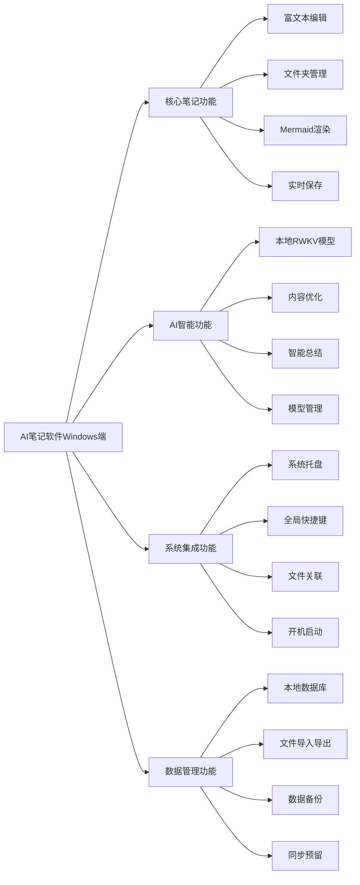
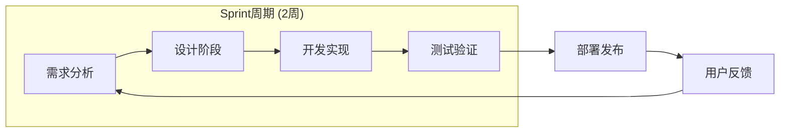
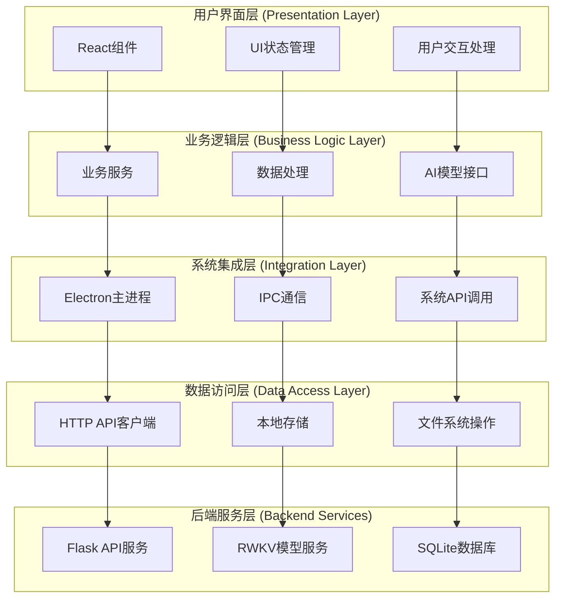
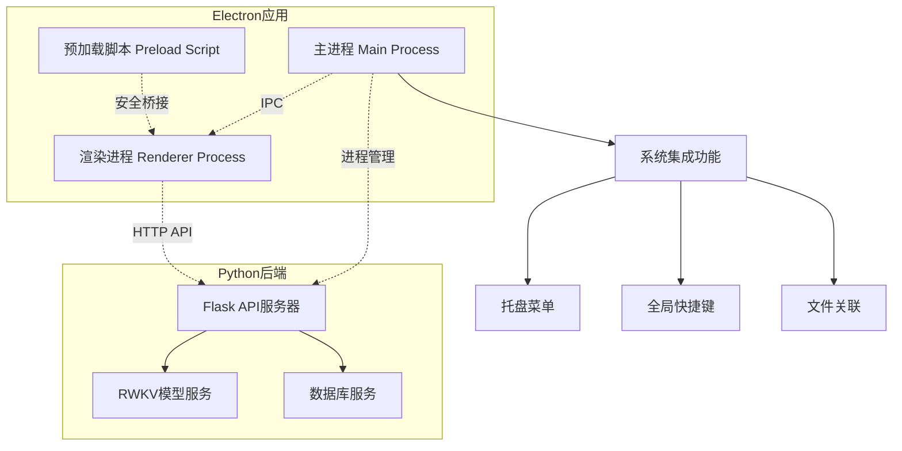
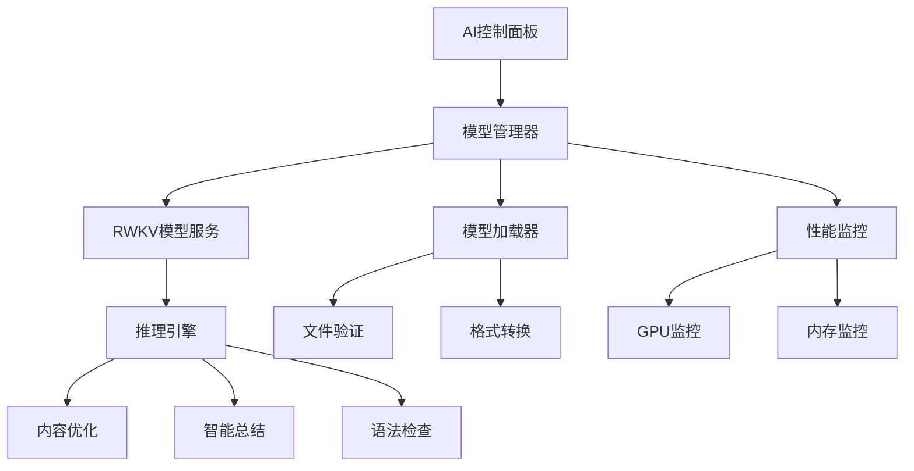
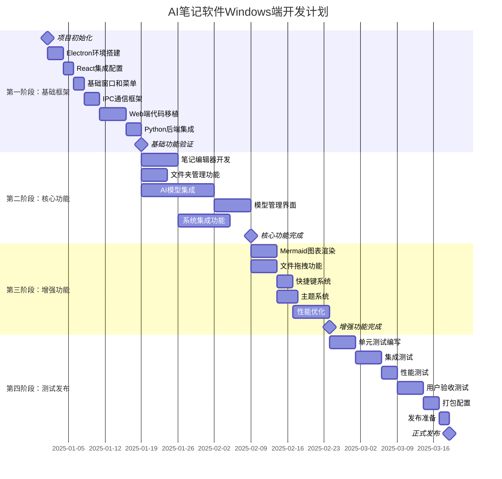
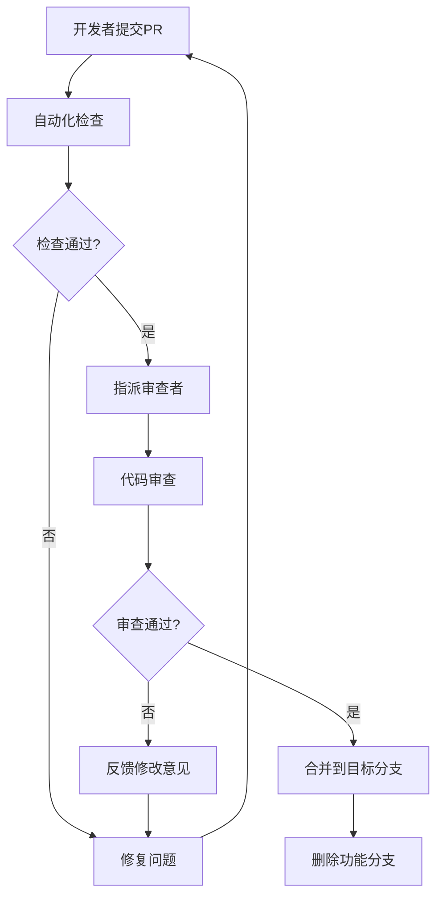

# AI笔记软件 - Windows端开发指导文档

> **版本**: v1.0  
> **创建时间**: 2025年8月28日  
> **文档类型**: 开发指导文档  
> **负责人**: 开发组长  
> **适用范围**: Windows桌面端开发团队

## 📋 目录导航

- [项目总体规划](#项目总体规划)
- [开发策略与方法论](#开发策略与方法论)
- [技术架构设计](#技术架构设计)
- [项目结构规范](#项目结构规范)
- [功能模块划分](#功能模块划分)
- [开发任务计划](#开发任务计划)
- [开发流程规范](#开发流程规范)
- [质量保证体系](#质量保证体系)
- [风险管控策略](#风险管控策略)
- [团队协作规范](#团队协作规范)

## 项目总体规划

### 项目背景与目标

#### 项目定位
AI笔记软件Windows端是一款**离线优先**的智能笔记管理应用，旨在为用户提供完全本地化的AI驱动笔记体验。项目核心目标是构建一个高性能、高可用、易维护的桌面应用程序。

#### 核心价值主张
- **数据隐私**: 100%本地化运行，零数据泄露风险
- **AI本地化**: 集成RWKV大模型，无需依赖第三方AI服务
- **性能优越**: 充分利用桌面端计算资源，提供流畅体验
- **系统集成**: 深度集成Windows生态，提供原生应用体验

#### 项目成功指标
- **性能指标**: 冷启动时间 < 3秒，AI模型加载 < 10秒
- **资源指标**: 空闲内存占用 < 200MB，AI运行时 < 8GB
- **用户体验**: 界面响应时间 < 100ms，操作流畅度 > 95%
- **稳定性**: 崩溃率 < 0.1%，数据丢失率 = 0%

### 项目范围与边界

#### 功能范围


#### 技术边界
- **支持平台**: Windows 10/11 (x64)
- **最低配置**: 8GB RAM, 4GB可用存储空间
- **推荐配置**: 16GB RAM, NVIDIA GPU (支持CUDA)
- **依赖环境**: Node.js 18+, Python 3.12+

## 开发策略与方法论

### 开发方法论选择

#### 敏捷开发 + MVP策略
我们采用**敏捷开发**方法论，结合 **MVP(最小可行产品)** 策略，确保快速交付和持续迭代。



#### 开发原则
1. **代码复用优先**: 最大化复用Web端已有代码和组件
2. **渐进式增强**: 先实现基础功能，再逐步添加高级特性
3. **性能优先**: 每个功能都要考虑性能影响和优化空间
4. **用户体验驱动**: 所有技术决策都要以用户体验为核心
5. **可维护性**: 代码结构清晰，文档完善，便于后续维护

### 技术选型策略

#### 主技术栈决策矩阵

| 技术选项 | 开发效率 | 性能表现 | 维护成本 | 生态成熟度 | 团队熟悉度 | 综合评分 |
|---------|---------|---------|---------|-----------|-----------|----------|
| **Electron + React** | 9 | 7 | 8 | 9 | 9 | **42** |
| Tauri + React | 7 | 9 | 7 | 6 | 6 | 35 |
| .NET WPF | 6 | 9 | 6 | 8 | 4 | 33 |
| Qt + C++ | 5 | 10 | 5 | 8 | 3 | 31 |

**决策结果**: 选择 **Electron + React** 作为主技术栈

#### 技术选型理由
1. **开发效率最高**: 可直接复用Web端React组件，减少70%+开发工作量
2. **团队技能匹配**: 团队已具备React开发经验，学习成本最低
3. **生态成熟**: Electron生态完善，第三方库丰富
4. **跨平台潜力**: 为后续Mac版本开发奠定基础

## 技术架构设计

### 整体架构设计

#### 分层架构图


#### 进程架构设计


### 核心模块设计

#### 1. AI模型管理模块
```typescript
// AI模型管理器接口设计
interface AIModelManager {
  // 模型生命周期管理
  loadModel(modelPath: string, config: ModelConfig): Promise<boolean>;
  unloadModel(): Promise<boolean>;
  getModelStatus(): ModelStatus;
  
  // 模型推理接口
  generateText(prompt: string, options: GenerationOptions): Promise<string>;
  optimizeContent(content: string, type: OptimizationType): Promise<string>;
  
  // 模型配置管理
  setDeviceMode(mode: 'gpu' | 'cpu' | 'auto'): Promise<boolean>;
  updateModelConfig(config: Partial<ModelConfig>): Promise<boolean>;
  
  // 性能监控
  getPerformanceMetrics(): PerformanceMetrics;
  onStatusChange(callback: (status: ModelStatus) => void): void;
}

// 数据结构定义
interface ModelConfig {
  deviceMode: 'gpu' | 'cpu' | 'auto';
  maxMemory: number;
  threadCount: number;
  enableQuantization: boolean;
  enableCache: boolean;
}

interface ModelStatus {
  isLoaded: boolean;
  modelName: string;
  deviceMode: string;
  memoryUsage: number;
  loadTime: number;
  lastError?: string;
}
```

#### 2. 系统集成模块
```typescript
// 系统集成管理器
interface SystemIntegrationManager {
  // 托盘管理
  createTrayIcon(): void;
  updateTrayMenu(items: TrayMenuItem[]): void;
  showTrayNotification(message: string, options?: NotificationOptions): void;
  
  // 快捷键管理
  registerGlobalShortcut(accelerator: string, callback: () => void): boolean;
  unregisterGlobalShortcut(accelerator: string): boolean;
  
  // 文件关联
  registerFileAssociation(extensions: string[]): Promise<boolean>;
  handleFileOpen(filePath: string): void;
  
  // 启动管理
  setAutoStart(enabled: boolean): Promise<boolean>;
  getAutoStartStatus(): Promise<boolean>;
}
```

#### 3. 数据同步模块 (预留)
```typescript
// 数据同步管理器 (为后续云同步功能预留)
interface DataSyncManager {
  // 同步配置
  configureSyncSettings(settings: SyncSettings): Promise<boolean>;
  getSyncSettings(): SyncSettings;
  
  // 同步操作
  startSync(): Promise<SyncResult>;
  stopSync(): void;
  forceSyncNow(): Promise<SyncResult>;
  
  // 冲突处理
  resolveConflict(conflictId: string, resolution: ConflictResolution): Promise<boolean>;
  getConflicts(): Conflict[];
  
  // 同步状态
  getSyncStatus(): SyncStatus;
  onSyncStatusChange(callback: (status: SyncStatus) => void): void;
}
```

## 项目结构规范

### 目录结构设计

```
Win/
├── docs/                           # 项目文档
│   ├── DEVELOPMENT_GUIDE.md        # 开发指导文档 (本文档)
│   ├── PRODUCT_MANUAL_WINDOWS.md   # 产品需求文档
│   ├── API_SPECIFICATION.md        # API接口规范
│   └── DEPLOYMENT_GUIDE.md         # 部署指南
├── electron/                       # Electron主进程代码
│   ├── main.js                     # 应用程序入口
│   ├── preload.js                  # 预加载脚本
│   ├── managers/                   # 管理器模块
│   │   ├── ai-model-manager.js     # AI模型管理
│   │   ├── system-integration.js   # 系统集成
│   │   ├── window-manager.js       # 窗口管理
│   │   ├── file-manager.js         # 文件管理
│   │   └── data-sync-manager.js    # 数据同步 (预留)
│   ├── services/                   # 服务层
│   │   ├── backend-service.js      # 后端服务管理
│   │   ├── config-service.js       # 配置管理
│   │   └── logger-service.js       # 日志服务
│   └── utils/                      # 工具函数
│       ├── path-utils.js           # 路径处理
│       ├── process-utils.js        # 进程管理
│       └── security-utils.js       # 安全工具
├── src/                            # 渲染进程代码 (React)
│   ├── components/                 # React组件
│   │   ├── common/                 # 通用组件
│   │   │   ├── Button/             # 按钮组件
│   │   │   ├── Modal/              # 模态框组件
│   │   │   ├── Loading/            # 加载组件
│   │   │   └── ErrorBoundary/      # 错误边界
│   │   ├── editor/                 # 编辑器组件
│   │   │   ├── NoteEditor/         # 笔记编辑器
│   │   │   ├── MarkdownRenderer/   # Markdown渲染
│   │   │   ├── MermaidRenderer/    # Mermaid图表
│   │   │   └── CodeHighlighter/    # 代码高亮
│   │   ├── sidebar/                # 侧边栏组件
│   │   │   ├── FolderTree/         # 文件夹树
│   │   │   ├── SearchPanel/        # 搜索面板
│   │   │   └── TagPanel/           # 标签面板
│   │   ├── ai/                     # AI相关组件
│   │   │   ├── AIControlPanel/     # AI控制面板
│   │   │   ├── ModelSelector/      # 模型选择器
│   │   │   ├── PerformanceMonitor/ # 性能监控
│   │   │   └── OptimizationPanel/  # 优化面板
│   │   ├── system/                 # 系统集成组件
│   │   │   ├── TrayMenu/           # 托盘菜单
│   │   │   ├── SettingsDialog/     # 设置对话框
│   │   │   ├── ShortcutManager/    # 快捷键管理
│   │   │   └── FileDropZone/       # 文件拖拽区
│   │   └── layout/                 # 布局组件
│   │       ├── MainLayout/         # 主布局
│   │       ├── Toolbar/            # 工具栏
│   │       ├── StatusBar/          # 状态栏
│   │       └── TabManager/         # 标签页管理
│   ├── hooks/                      # React Hooks
│   │   ├── useAIModel.js           # AI模型Hook
│   │   ├── useSystemIntegration.js # 系统集成Hook
│   │   ├── useFileImport.js        # 文件导入Hook
│   │   ├── useKeyboardShortcuts.js # 快捷键Hook
│   │   └── useDataSync.js          # 数据同步Hook (预留)
│   ├── services/                   # 前端服务层
│   │   ├── api/                    # API服务
│   │   │   ├── notes-api.js        # 笔记API
│   │   │   ├── ai-api.js           # AI API
│   │   │   ├── files-api.js        # 文件API
│   │   │   └── sync-api.js         # 同步API (预留)
│   │   ├── electron-api.js         # Electron API封装
│   │   ├── storage-service.js      # 本地存储服务
│   │   └── theme-service.js        # 主题服务
│   ├── store/                      # 状态管理
│   │   ├── index.js                # Store入口
│   │   ├── slices/                 # Redux Slices
│   │   │   ├── notes-slice.js      # 笔记状态
│   │   │   ├── ai-slice.js         # AI状态
│   │   │   ├── ui-slice.js         # UI状态
│   │   │   └── settings-slice.js   # 设置状态
│   │   └── middleware/             # 中间件
│   │       ├── api-middleware.js   # API中间件
│   │       └── logger-middleware.js # 日志中间件
│   ├── utils/                      # 工具函数
│   │   ├── format-utils.js         # 格式化工具
│   │   ├── validation-utils.js     # 验证工具
│   │   ├── date-utils.js           # 日期工具
│   │   └── file-utils.js           # 文件工具
│   ├── styles/                     # 样式文件
│   │   ├── globals.css             # 全局样式
│   │   ├── variables.css           # CSS变量
│   │   ├── themes/                 # 主题样式
│   │   │   ├── light.css           # 浅色主题
│   │   │   └── dark.css            # 深色主题
│   │   └── components/             # 组件样式
│   ├── assets/                     # 静态资源
│   │   ├── icons/                  # 图标文件
│   │   ├── images/                 # 图片文件
│   │   └── fonts/                  # 字体文件
│   ├── App.jsx                     # 应用根组件
│   ├── main.jsx                    # 应用入口
│   └── index.html                  # HTML模板
├── backend/                        # Python后端 (软链接到Web/app)
├── tests/                          # 测试文件
│   ├── unit/                       # 单元测试
│   │   ├── components/             # 组件测试
│   │   ├── hooks/                  # Hook测试
│   │   ├── services/               # 服务测试
│   │   └── utils/                  # 工具测试
│   ├── integration/                # 集成测试
│   │   ├── api/                    # API测试
│   │   ├── electron/               # Electron测试
│   │   └── ai-model/               # AI模型测试
│   ├── e2e/                        # 端到端测试
│   │   ├── user-flows/             # 用户流程测试
│   │   └── performance/            # 性能测试
│   └── fixtures/                   # 测试数据
├── build/                          # 构建配置
│   ├── webpack.config.js           # Webpack配置
│   ├── vite.config.js              # Vite配置
│   ├── electron-builder.yml        # 打包配置
│   └── scripts/                    # 构建脚本
│       ├── build.js                # 构建脚本
│       ├── dev.js                  # 开发脚本
│       └── package.js              # 打包脚本
├── dist/                           # 构建输出
├── node_modules/                   # 依赖包
├── package.json                    # 项目配置
├── package-lock.json               # 依赖锁定
├── .gitignore                      # Git忽略文件
├── .eslintrc.js                    # ESLint配置
├── .prettierrc                     # Prettier配置
├── tsconfig.json                   # TypeScript配置
└── README.md                       # 项目说明
```

### 代码组织规范

#### 1. 组件组织规范
每个React组件都应该有独立的文件夹，包含以下文件：
```
ComponentName/
├── index.js                # 组件入口 (导出)
├── ComponentName.jsx       # 组件实现
├── ComponentName.module.css # 组件样式
├── ComponentName.test.js   # 组件测试
└── hooks/                  # 组件专用Hooks (可选)
    └── useComponentName.js
```

#### 2. 服务层组织规范
```javascript
// services/api/notes-api.js
export class NotesAPI {
  constructor(baseURL) {
    this.baseURL = baseURL;
  }
  
  async getNotes(folderId) {
    // 实现获取笔记逻辑
  }
  
  async createNote(noteData) {
    // 实现创建笔记逻辑
  }
  
  async updateNote(noteId, noteData) {
    // 实现更新笔记逻辑
  }
  
  async deleteNote(noteId) {
    // 实现删除笔记逻辑
  }
}
```

#### 3. 状态管理规范
使用Redux Toolkit进行状态管理：
```javascript
// store/slices/notes-slice.js
import { createSlice, createAsyncThunk } from '@reduxjs/toolkit';

export const fetchNotes = createAsyncThunk(
  'notes/fetchNotes',
  async (folderId, { rejectWithValue }) => {
    try {
      const response = await notesAPI.getNotes(folderId);
      return response.data;
    } catch (error) {
      return rejectWithValue(error.message);
    }
  }
);

const notesSlice = createSlice({
  name: 'notes',
  initialState: {
    items: [],
    loading: false,
    error: null,
    selectedNote: null
  },
  reducers: {
    selectNote: (state, action) => {
      state.selectedNote = action.payload;
    },
    clearError: (state) => {
      state.error = null;
    }
  },
  extraReducers: (builder) => {
    builder
      .addCase(fetchNotes.pending, (state) => {
        state.loading = true;
        state.error = null;
      })
      .addCase(fetchNotes.fulfilled, (state, action) => {
        state.loading = false;
        state.items = action.payload;
      })
      .addCase(fetchNotes.rejected, (state, action) => {
        state.loading = false;
        state.error = action.payload;
      });
  }
});

export const { selectNote, clearError } = notesSlice.actions;
export default notesSlice.reducer;
```

## 功能模块划分

### 核心功能模块

#### 1. 笔记编辑模块 (NoteEditor)
**负责人**: 前端开发工程师  
**优先级**: P0  
**预计工期**: 2周

**功能范围**:
- 富文本编辑器集成 (TipTap)
- Markdown语法支持
- 实时预览功能
- 代码高亮显示
- Mermaid图表渲染
- 数学公式支持 (KaTeX)
- 表格编辑功能
- 图片插入和管理

**技术实现**:
```javascript
// components/editor/NoteEditor/NoteEditor.jsx
import { useEditor, EditorContent } from '@tiptap/react';
import StarterKit from '@tiptap/starter-kit';
import CodeBlockLowlight from '@tiptap/extension-code-block-lowlight';
import { lowlight } from 'lowlight';

const NoteEditor = ({ content, onChange, onSave }) => {
  const editor = useEditor({
    extensions: [
      StarterKit,
      CodeBlockLowlight.configure({
        lowlight,
      }),
      // 其他扩展...
    ],
    content,
    onUpdate: ({ editor }) => {
      onChange(editor.getHTML());
    },
  });

  return (
    <div className="note-editor">
      <EditorContent editor={editor} />
    </div>
  );
};
```

**接口设计**:
```typescript
interface NoteEditorProps {
  content: string;
  onChange: (content: string) => void;
  onSave: () => void;
  readOnly?: boolean;
  theme?: 'light' | 'dark';
  extensions?: Extension[];
}
```

#### 2. AI智能模块 (AIModule)
**负责人**: 全栈开发工程师  
**优先级**: P0  
**预计工期**: 4周

**功能范围**:
- RWKV模型集成和管理
- 模型文件导入 (.pth, .st格式)
- GPU/CPU运行模式切换
- AI内容优化功能
- 智能总结生成
- 性能监控和调优
- 错误处理和恢复

**架构设计**:


**核心类设计**:
```javascript
// electron/managers/ai-model-manager.js
class AIModelManager {
  constructor() {
    this.currentModel = null;
    this.modelStatus = 'idle';
    this.performanceMetrics = {};
  }
  
  async loadModel(modelPath, config = {}) {
    try {
      // 验证模型文件
      await this.validateModelFile(modelPath);
      
      // 启动模型服务
      const result = await this.startModelService(modelPath, config);
      
      if (result.success) {
        this.currentModel = result.model;
        this.modelStatus = 'loaded';
        this.emit('model-loaded', result.model);
      }
      
      return result;
    } catch (error) {
      this.handleError(error);
      throw error;
    }
  }
  
  async optimizeContent(content, type = 'general') {
    if (!this.isModelReady()) {
      throw new Error('AI模型未就绪');
    }
    
    const prompt = this.buildOptimizationPrompt(content, type);
    return await this.generateText(prompt);
  }
  
  getPerformanceMetrics() {
    return {
      memoryUsage: this.getMemoryUsage(),
      gpuUsage: this.getGPUUsage(),
      inferenceTime: this.getAverageInferenceTime(),
      modelSize: this.getModelSize()
    };
  }
}
```

#### 3. 系统集成模块 (SystemIntegration)
**负责人**: 桌面端开发工程师  
**优先级**: P1  
**预计工期**: 2周

**功能范围**:
- 系统托盘集成
- 全局快捷键注册
- 文件关联处理
- 开机启动管理
- Windows通知集成
- 文件拖拽处理

**实现示例**:
```javascript
// electron/managers/system-integration.js
class SystemIntegrationManager {
  constructor(app, mainWindow) {
    this.app = app;
    this.mainWindow = mainWindow;
    this.tray = null;
    this.registeredShortcuts = new Map();
  }
  
  createTrayIcon() {
    const { Tray, Menu, nativeImage } = require('electron');
    
    const icon = nativeImage.createFromPath(path.join(__dirname, '../assets/tray-icon.png'));
    this.tray = new Tray(icon);
    
    const contextMenu = Menu.buildFromTemplate([
      {
        label: '显示主窗口',
        click: () => this.showMainWindow()
      },
      {
        label: '新建笔记',
        accelerator: 'CmdOrCtrl+N',
        click: () => this.createNewNote()
      },
      { type: 'separator' },
      {
        label: '退出',
        click: () => this.app.quit()
      }
    ]);
    
    this.tray.setContextMenu(contextMenu);
    this.tray.setToolTip('AI笔记软件');
  }
  
  registerGlobalShortcuts() {
    const { globalShortcut } = require('electron');
    
    const shortcuts = {
      'CmdOrCtrl+Shift+N': () => this.quickCreateNote(),
      'CmdOrCtrl+Shift+S': () => this.quickSearch(),
      'CmdOrCtrl+Shift+A': () => this.toggleAI()
    };
    
    Object.entries(shortcuts).forEach(([accelerator, callback]) => {
      const success = globalShortcut.register(accelerator, callback);
      if (success) {
        this.registeredShortcuts.set(accelerator, callback);
      }
    });
  }
}
```

#### 4. 数据管理模块 (DataManager)
**负责人**: 后端开发工程师  
**优先级**: P0  
**预计工期**: 1周

**功能范围**:
- 本地数据库管理
- 文件系统操作
- 数据备份和恢复
- 导入导出功能
- 数据同步预留接口

### 辅助功能模块

#### 5. 用户界面模块 (UIModule)
**负责人**: 前端开发工程师  
**优先级**: P1  
**预计工期**: 2周

**功能范围**:
- 主题管理系统
- 布局管理器
- 响应式设计
- 无障碍支持
- 国际化支持

#### 6. 配置管理模块 (ConfigManager)
**负责人**: 全栈开发工程师  
**优先级**: P2  
**预计工期**: 1周

**功能范围**:
- 应用配置管理
- 用户偏好设置
- 插件配置 (预留)
- 配置文件加密

## 开发任务计划

### 开发里程碑规划



### 详细任务分解

#### Sprint 1: 基础框架搭建 (Week 1-3)

**Sprint目标**: 搭建完整的开发环境和基础架构

| 任务ID | 任务名称 | 负责人 | 优先级 | 预计工时 | 依赖关系 |
|--------|---------|--------|--------|----------|----------|
| T1.1 | Electron项目初始化 | 全栈工程师 | P0 | 8h | - |
| T1.2 | React + Vite集成配置 | 前端工程师 | P0 | 6h | T1.1 |
| T1.3 | 基础窗口管理实现 | 桌面端工程师 | P0 | 8h | T1.2 |
| T1.4 | IPC通信框架搭建 | 桌面端工程师 | P0 | 12h | T1.3 |
| T1.5 | Web端组件移植 | 前端工程师 | P0 | 20h | T1.4 |
| T1.6 | Python后端进程管理 | 后端工程师 | P0 | 12h | T1.4 |
| T1.7 | 基础API连接测试 | 全栈工程师 | P0 | 8h | T1.5, T1.6 |
| T1.8 | 开发环境优化 | DevOps工程师 | P1 | 6h | T1.7 |

**验收标准**:
- [ ] Electron应用能够正常启动
- [ ] React界面能够正常渲染
- [ ] 主进程与渲染进程IPC通信正常
- [ ] Python后端能够正常启动和停止
- [ ] 基础API调用功能正常
- [ ] 热重载开发环境配置完成

#### Sprint 2: 核心编辑功能 (Week 4-5)

**Sprint目标**: 实现完整的笔记编辑和管理功能

| 任务ID | 任务名称 | 负责人 | 优先级 | 预计工时 | 依赖关系 |
|--------|---------|--------|--------|----------|----------|
| T2.1 | TipTap编辑器集成 | 前端工程师 | P0 | 16h | Sprint 1 |
| T2.2 | Markdown语法支持 | 前端工程师 | P0 | 8h | T2.1 |
| T2.3 | 代码高亮功能 | 前端工程师 | P1 | 6h | T2.2 |
| T2.4 | 文件夹树组件 | 前端工程师 | P0 | 12h | Sprint 1 |
| T2.5 | 笔记CRUD操作 | 全栈工程师 | P0 | 16h | T2.4 |
| T2.6 | 实时保存功能 | 全栈工程师 | P0 | 8h | T2.5 |
| T2.7 | 搜索功能实现 | 后端工程师 | P1 | 12h | T2.5 |
| T2.8 | 拖拽排序功能 | 前端工程师 | P1 | 10h | T2.4 |

**验收标准**:
- [ ] 富文本编辑器功能完整
- [ ] 文件夹管理功能正常
- [ ] 笔记的增删改查功能正常
- [ ] 实时保存功能稳定
- [ ] 搜索功能准确快速
- [ ] 拖拽操作流畅

#### Sprint 3: AI模型集成 (Week 6-9)

**Sprint目标**: 完成RWKV模型的完整集成

| 任务ID | 任务名称 | 负责人 | 优先级 | 预计工时 | 依赖关系 |
|--------|---------|--------|--------|----------|----------|
| T3.1 | RWKV模型服务架构设计 | 架构师 | P0 | 8h | Sprint 2 |
| T3.2 | 模型加载器实现 | AI工程师 | P0 | 20h | T3.1 |
| T3.3 | GPU/CPU切换逻辑 | AI工程师 | P0 | 16h | T3.2 |
| T3.4 | 模型文件验证和导入 | 后端工程师 | P0 | 12h | T3.2 |
| T3.5 | AI控制面板UI | 前端工程师 | P0 | 16h | T3.3 |
| T3.6 | 内容优化API | AI工程师 | P0 | 20h | T3.3 |
| T3.7 | 性能监控系统 | 全栈工程师 | P1 | 12h | T3.6 |
| T3.8 | 错误处理和恢复 | 全栈工程师 | P0 | 10h | T3.6 |

**验收标准**:
- [ ] RWKV模型能够正常加载和卸载
- [ ] GPU/CPU模式切换功能正常
- [ ] 模型文件导入功能完整
- [ ] AI内容优化功能可用
- [ ] 性能监控数据准确
- [ ] 错误处理机制完善

#### Sprint 4: 系统集成 (Week 10-11)

**Sprint目标**: 实现Windows系统深度集成功能

| 任务ID | 任务名称 | 负责人 | 优先级 | 预计工时 | 依赖关系 |
|--------|---------|--------|--------|----------|----------|
| T4.1 | 系统托盘功能 | 桌面端工程师 | P1 | 12h | Sprint 3 |
| T4.2 | 全局快捷键注册 | 桌面端工程师 | P1 | 8h | T4.1 |
| T4.3 | 文件关联处理 | 桌面端工程师 | P1 | 10h | T4.2 |
| T4.4 | 开机启动管理 | 桌面端工程师 | P2 | 6h | T4.3 |
| T4.5 | 文件拖拽功能 | 前端工程师 | P1 | 8h | Sprint 3 |
| T4.6 | Windows通知集成 | 桌面端工程师 | P2 | 6h | T4.1 |
| T4.7 | 多窗口支持 | 桌面端工程师 | P2 | 12h | T4.5 |
| T4.8 | 系统集成测试 | 测试工程师 | P1 | 8h | T4.7 |

**验收标准**:
- [ ] 系统托盘功能完整
- [ ] 全局快捷键响应正常
- [ ] 文件关联功能正确
- [ ] 开机启动选项可用
- [ ] 文件拖拽操作流畅
- [ ] 系统通知显示正常

#### Sprint 5: 增强功能 (Week 12-13)

**Sprint目标**: 实现差异化的增强功能

| 任务ID | 任务名称 | 负责人 | 优先级 | 预计工时 | 依赖关系 |
|--------|---------|--------|--------|----------|----------|
| T5.1 | Mermaid图表渲染 | 前端工程师 | P1 | 12h | Sprint 4 |
| T5.2 | 图片管理功能 | 全栈工程师 | P1 | 10h | T5.1 |
| T5.3 | 主题系统实现 | 前端工程师 | P2 | 8h | T5.2 |
| T5.4 | 标签页管理 | 前端工程师 | P2 | 10h | T5.3 |
| T5.5 | 导入导出功能 | 后端工程师 | P1 | 8h | Sprint 4 |
| T5.6 | 历史版本管理 | 后端工程师 | P2 | 12h | T5.5 |
| T5.7 | 性能优化 | 全栈工程师 | P1 | 16h | T5.6 |
| T5.8 | 用户体验优化 | UI/UX工程师 | P1 | 8h | T5.7 |

**验收标准**:
- [ ] Mermaid图表正确渲染
- [ ] 图片插入和管理功能完整
- [ ] 主题切换功能正常
- [ ] 标签页操作流畅
- [ ] 导入导出功能可靠
- [ ] 应用性能达标

#### Sprint 6: 测试与发布 (Week 14-15)

**Sprint目标**: 完成全面测试和发布准备

| 任务ID | 任务名称 | 负责人 | 优先级 | 预计工时 | 依赖关系 |
|--------|---------|--------|--------|----------|----------|
| T6.1 | 单元测试编写 | 测试工程师 | P0 | 20h | Sprint 5 |
| T6.2 | 集成测试执行 | 测试工程师 | P0 | 16h | T6.1 |
| T6.3 | 性能测试 | 测试工程师 | P0 | 12h | T6.2 |
| T6.4 | 兼容性测试 | 测试工程师 | P0 | 8h | T6.3 |
| T6.5 | 安全测试 | 安全工程师 | P1 | 8h | T6.4 |
| T6.6 | 用户验收测试 | 产品经理 | P0 | 12h | T6.5 |
| T6.7 | 打包配置优化 | DevOps工程师 | P0 | 8h | T6.6 |
| T6.8 | 发布文档编写 | 技术写作 | P0 | 6h | T6.7 |

**验收标准**:
- [ ] 测试覆盖率 > 80%
- [ ] 所有关键功能测试通过
- [ ] 性能指标达到预期
- [ ] 兼容性测试通过
- [ ] 安全漏洞修复完成
- [ ] 用户验收测试通过
- [ ] 安装包构建成功
- [ ] 发布文档完整

## 开发流程规范

### Git工作流规范

#### 分支管理策略
我们采用**Git Flow**工作流，确保代码质量和发布稳定性。

```mermaid
gitgraph
    commit id: "Initial"
    branch develop
    checkout develop
    commit id: "Setup project"
    
    branch feature/note-editor
    checkout feature/note-editor
    commit id: "Add TipTap"
    commit id: "Add Markdown"
    checkout develop
    merge feature/note-editor
    
    branch feature/ai-integration
    checkout feature/ai-integration
    commit id: "Add RWKV"
    commit id: "Add AI API"
    checkout develop
    merge feature/ai-integration
    
    branch release/v1.0
    checkout release/v1.0
    commit id: "Bug fixes"
    commit id: "Performance"
    
    checkout main
    merge release/v1.0
    commit id: "v1.0 Release" tag: "v1.0"
    
    checkout develop
    merge release/v1.0
```

#### 分支命名规范
- **主分支**: `main` - 生产环境代码
- **开发分支**: `develop` - 开发环境代码
- **功能分支**: `feature/功能名称` - 新功能开发
- **修复分支**: `hotfix/问题描述` - 紧急修复
- **发布分支**: `release/版本号` - 发布准备

#### 提交信息规范
使用**Conventional Commits**规范：

```
<type>[optional scope]: <description>

[optional body]

[optional footer(s)]
```

**类型说明**:
- `feat`: 新功能
- `fix`: 修复bug
- `docs`: 文档更新
- `style`: 代码格式调整
- `refactor`: 代码重构
- `test`: 测试相关
- `chore`: 构建过程或辅助工具的变动

**示例**:
```
feat(ai): add RWKV model integration

- Implement model loading and unloading
- Add GPU/CPU mode switching
- Support .pth and .st file formats

Closes #123
```

### 代码审查流程

#### Pull Request规范
1. **PR标题**: 简洁描述变更内容
2. **PR描述**: 详细说明变更原因和实现方式
3. **关联Issue**: 链接相关的Issue或任务
4. **测试说明**: 描述如何测试这些变更
5. **截图/录屏**: 对于UI变更，提供视觉证明

#### 审查检查清单
- [ ] 代码符合项目编码规范
- [ ] 功能实现符合需求描述
- [ ] 包含必要的单元测试
- [ ] 没有明显的性能问题
- [ ] 错误处理机制完善
- [ ] 代码注释清晰易懂
- [ ] 没有安全漏洞
- [ ] 向后兼容性良好

#### 审查流程


### 持续集成/持续部署 (CI/CD)

#### GitHub Actions配置
```yaml
# .github/workflows/ci.yml
name: CI/CD Pipeline

on:
  push:
    branches: [ main, develop ]
  pull_request:
    branches: [ main, develop ]

jobs:
  test:
    runs-on: windows-latest
    
    steps:
    - uses: actions/checkout@v3
    
    - name: Setup Node.js
      uses: actions/setup-node@v3
      with:
        node-version: '18'
        cache: 'npm'
    
    - name: Setup Python
      uses: actions/setup-python@v4
      with:
        python-version: '3.12'
    
    - name: Install dependencies
      run: |
        npm ci
        pip install -r backend/requirements.txt
    
    - name: Run linting
      run: |
        npm run lint
        flake8 backend/
    
    - name: Run tests
      run: |
        npm run test
        pytest backend/tests/
    
    - name: Build application
      run: npm run build
    
    - name: Upload coverage reports
      uses: codecov/codecov-action@v3
  
  build:
    needs: test
    runs-on: windows-latest
    if: github.ref == 'refs/heads/main'
    
    steps:
    - uses: actions/checkout@v3
    
    - name: Setup Node.js
      uses: actions/setup-node@v3
      with:
        node-version: '18'
        cache: 'npm'
    
    - name: Install dependencies
      run: npm ci
    
    - name: Build and package
      run: npm run package
    
    - name: Upload artifacts
      uses: actions/upload-artifact@v3
      with:
        name: windows-installer
        path: dist/*.exe
```

## 质量保证体系

### 测试策略

#### 测试金字塔
```mermaid
pyramid
    title 测试金字塔
    
    "E2E Tests (10%)" : 5
    "Integration Tests (20%)" : 15  
    "Unit Tests (70%)" : 35
```

#### 1. 单元测试 (70%)
**目标**: 确保每个函数和组件的正确性

**工具栈**:
- **前端**: Jest + React Testing Library
- **后端**: pytest + unittest.mock
- **Electron**: Spectron

**测试示例**:
```javascript
// tests/unit/components/NoteEditor.test.jsx
import { render, screen, fireEvent } from '@testing-library/react';
import { NoteEditor } from '../../../src/components/editor/NoteEditor';

describe('NoteEditor', () => {
  it('should render editor with initial content', () => {
    const initialContent = '<p>Hello World</p>';
    const onChange = jest.fn();
    
    render(
      <NoteEditor 
        content={initialContent} 
        onChange={onChange} 
      />
    );
    
    expect(screen.getByText('Hello World')).toBeInTheDocument();
  });
  
  it('should call onChange when content is modified', () => {
    const onChange = jest.fn();
    
    render(
      <NoteEditor 
        content="" 
        onChange={onChange} 
      />
    );
    
    const editor = screen.getByRole('textbox');
    fireEvent.input(editor, { target: { innerHTML: '<p>New content</p>' } });
    
    expect(onChange).toHaveBeenCalledWith('<p>New content</p>');
  });
});
```

#### 2. 集成测试 (20%)
**目标**: 验证模块间的交互和API接口

**测试范围**:
- API端点测试
- 数据库操作测试
- Electron IPC通信测试
- AI模型集成测试

**测试示例**:
```javascript
// tests/integration/api/notes.test.js
import request from 'supertest';
import { app } from '../../../backend/app';
import { setupTestDB, cleanupTestDB } from '../../fixtures/database';

describe('Notes API', () => {
  beforeAll(async () => {
    await setupTestDB();
  });
  
  afterAll(async () => {
    await cleanupTestDB();
  });
  
  describe('POST /api/notes', () => {
    it('should create a new note', async () => {
      const noteData = {
        title: 'Test Note',
        content: 'This is a test note',
        folderId: 1
      };
      
      const response = await request(app)
        .post('/api/notes')
        .send(noteData)
        .expect(201);
      
      expect(response.body).toMatchObject({
        id: expect.any(Number),
        title: noteData.title,
        content: noteData.content,
        folderId: noteData.folderId,
        createdAt: expect.any(String)
      });
    });
  });
});
```

#### 3. 端到端测试 (10%)
**目标**: 验证完整的用户工作流

**工具**: Playwright

**测试示例**:
```javascript
// tests/e2e/note-creation.spec.js
import { test, expect } from '@playwright/test';

test.describe('Note Creation Flow', () => {
  test('user can create and edit a note', async ({ page }) => {
    // 启动应用
    await page.goto('/');
    
    // 创建新笔记
    await page.click('[data-testid="new-note-button"]');
    
    // 输入标题
    await page.fill('[data-testid="note-title"]', 'My Test Note');
    
    // 输入内容
    await page.fill('[data-testid="note-editor"]', 'This is my test note content.');
    
    // 验证自动保存
    await page.waitForSelector('[data-testid="save-indicator"]');
    
    // 验证笔记出现在侧边栏
    await expect(page.locator('[data-testid="note-list"]')).toContainText('My Test Note');
    
    // 测试AI优化功能
    await page.click('[data-testid="ai-optimize-button"]');
    await page.waitForSelector('[data-testid="ai-loading"]');
    await page.waitForSelector('[data-testid="ai-result"]');
    
    // 验证优化结果
    const optimizedContent = await page.textContent('[data-testid="ai-result"]');
    expect(optimizedContent).toBeTruthy();
  });
  
  test('user can import and manage AI models', async ({ page }) => {
    await page.goto('/');
    
    // 打开AI设置
    await page.click('[data-testid="ai-settings-button"]');
    
    // 导入模型文件
    const fileInput = page.locator('input[type="file"]');
    await fileInput.setInputFiles('tests/fixtures/test-model.pth');
    
    // 等待模型验证
    await page.waitForSelector('[data-testid="model-validation-success"]');
    
    // 加载模型
    await page.click('[data-testid="load-model-button"]');
    
    // 验证模型状态
    await expect(page.locator('[data-testid="model-status"]')).toContainText('已加载');
    
    // 测试GPU/CPU切换
    await page.click('[data-testid="device-mode-toggle"]');
    await page.waitForSelector('[data-testid="device-switch-success"]');
  });
});

### 性能测试

#### 性能基准
| 指标 | 目标值 | 测试方法 |
|------|--------|----------|
| 冷启动时间 | < 3秒 | 应用启动到界面可交互 |
| AI模型加载 | < 10秒 | 模型文件加载到推理就绪 |
| 内存占用 | < 200MB (空闲) | 应用空闲状态内存使用 |
| AI运行内存 | < 8GB | AI模型运行时峰值内存 |
| 界面响应 | < 100ms | 用户操作到界面响应 |
| 文件保存 | < 500ms | 笔记保存操作完成时间 |

#### 性能测试脚本
```javascript
// tests/performance/startup.test.js
import { performance } from 'perf_hooks';
import { app } from 'electron';

describe('Performance Tests', () => {
  test('application startup time', async () => {
    const startTime = performance.now();
    
    // 启动应用
    await app.whenReady();
    
    const endTime = performance.now();
    const startupTime = endTime - startTime;
    
    expect(startupTime).toBeLessThan(3000); // 3秒内启动
  });
  
  test('AI model loading time', async () => {
    const startTime = performance.now();
    
    // 加载AI模型
    const result = await aiModelManager.loadModel('test-model.pth');
    
    const endTime = performance.now();
    const loadTime = endTime - startTime;
    
    expect(result.success).toBe(true);
    expect(loadTime).toBeLessThan(10000); // 10秒内加载
  });
});
```

## 风险管控策略

### 技术风险评估

#### 高风险项目

| 风险项目 | 风险等级 | 影响程度 | 发生概率 | 应对策略 |
|----------|----------|----------|----------|----------|
| RWKV模型兼容性问题 | 高 | 高 | 中 | 提前验证多种模型格式，准备降级方案 |
| Electron性能问题 | 中 | 高 | 中 | 性能监控，代码优化，内存管理 |
| Python后端集成复杂 | 中 | 中 | 高 | 简化架构，充分测试，文档完善 |
| GPU驱动兼容性 | 中 | 中 | 中 | 多GPU测试，CPU降级方案 |
| 数据丢失风险 | 高 | 高 | 低 | 实时备份，版本控制，恢复机制 |

#### 风险应对措施

**1. RWKV模型兼容性风险**
- **预防措施**:
  - 建立模型测试矩阵，覆盖主流RWKV模型
  - 实现模型格式验证和转换工具
  - 提供模型兼容性文档和推荐列表

- **应急预案**:
  - 准备CPU推理降级方案
  - 实现模型热切换功能
  - 提供离线模型下载服务

**2. 性能风险**
- **监控指标**:
  ```javascript
  // 性能监控系统
  class PerformanceMonitor {
    constructor() {
      this.metrics = {
        memoryUsage: [],
        cpuUsage: [],
        renderTime: [],
        apiResponseTime: []
      };
    }
    
    startMonitoring() {
      setInterval(() => {
        this.collectMetrics();
        this.checkThresholds();
      }, 5000);
    }
    
    collectMetrics() {
      const memInfo = process.memoryUsage();
      this.metrics.memoryUsage.push({
        timestamp: Date.now(),
        heapUsed: memInfo.heapUsed,
        heapTotal: memInfo.heapTotal,
        external: memInfo.external
      });
    }
    
    checkThresholds() {
      const currentMemory = this.getCurrentMemoryUsage();
      if (currentMemory > 500 * 1024 * 1024) { // 500MB
        this.triggerMemoryCleanup();
      }
    }
  }
  ```

**3. 数据安全风险**
- **备份策略**:
  - 实时增量备份
  - 每日全量备份
  - 版本历史保留
  - 云端备份选项 (可选)

- **恢复机制**:
  ```javascript
  // 数据恢复服务
  class DataRecoveryService {
    async createBackup() {
      const timestamp = new Date().toISOString();
      const backupPath = path.join(app.getPath('userData'), 'backups', timestamp);
      
      await this.copyDatabase(backupPath);
      await this.compressBackup(backupPath);
      
      return backupPath;
    }
    
    async restoreFromBackup(backupPath) {
      try {
        await this.validateBackup(backupPath);
        await this.stopServices();
        await this.restoreDatabase(backupPath);
        await this.startServices();
        
        return { success: true };
      } catch (error) {
        await this.rollbackRestore();
        throw error;
      }
    }
  }
  ```

### 项目风险管控

#### 进度风险控制
- **里程碑检查**: 每个Sprint结束进行里程碑评估
- **风险预警**: 提前2周识别进度风险
- **资源调配**: 关键路径任务优先分配资源
- **范围调整**: 必要时调整功能范围确保核心交付

#### 质量风险控制
- **代码审查**: 所有代码必须经过审查
- **自动化测试**: 持续集成确保代码质量
- **性能监控**: 实时监控应用性能指标
- **用户反馈**: 早期用户测试收集反馈

## 团队协作规范

### 团队组织结构

```mermaid
organizationchart TB
    A[项目经理] --> B[技术负责人]
    A --> C[产品负责人]
    
    B --> D[前端开发工程师]
    B --> E[后端开发工程师]
    B --> F[桌面端开发工程师]
    B --> G[AI工程师]
    
    C --> H[UI/UX设计师]
    C --> I[测试工程师]
    C --> J[DevOps工程师]
```

### 角色职责定义

| 角色 | 主要职责 | 技能要求 |
|------|----------|----------|
| **项目经理** | 项目计划、进度管控、风险管理、团队协调 | 项目管理、沟通协调、风险控制 |
| **技术负责人** | 技术架构、代码审查、技术决策、团队指导 | 全栈开发、架构设计、团队管理 |
| **前端开发工程师** | React组件开发、UI实现、用户交互 | React、TypeScript、CSS、Electron |
| **后端开发工程师** | API开发、数据库设计、业务逻辑 | Python、Flask、SQLite、API设计 |
| **桌面端开发工程师** | Electron集成、系统API、原生功能 | Electron、Node.js、系统编程 |
| **AI工程师** | RWKV集成、模型优化、AI功能开发 | Python、深度学习、RWKV、GPU编程 |
| **UI/UX设计师** | 界面设计、交互设计、用户体验 | Figma、设计系统、用户研究 |
| **测试工程师** | 测试计划、自动化测试、质量保证 | Jest、Playwright、性能测试 |
| **DevOps工程师** | CI/CD、构建部署、环境管理 | GitHub Actions、Docker、自动化 |

### 沟通协作机制

#### 会议制度
- **每日站会** (15分钟): 进度同步、问题识别
- **Sprint计划会** (2小时): 任务规划、工作量评估
- **Sprint回顾会** (1小时): 总结经验、改进流程
- **技术评审会** (1小时): 架构讨论、技术决策
- **代码评审会** (30分钟): 重要功能代码集体评审

#### 协作工具
- **项目管理**: GitHub Projects
- **代码管理**: GitHub
- **文档协作**: GitHub Wiki
- **即时通讯**: 企业微信/Slack
- **设计协作**: Figma
- **知识管理**: Notion

#### 知识分享机制
- **技术分享会**: 每周五下午，团队成员轮流分享
- **代码走读**: 重要功能完成后进行团队代码走读
- **文档维护**: 及时更新技术文档和API文档
- **经验总结**: 项目阶段性总结和最佳实践分享

### 开发环境规范

#### 统一开发环境
```bash
# 环境要求
Node.js: 18.x LTS
Python: 3.12.x
npm: 9.x
Git: 2.40+
VS Code: 最新版本

# 必装VS Code插件
- ES7+ React/Redux/React-Native snippets
- Prettier - Code formatter
- ESLint
- Python
- GitLens
- Thunder Client (API测试)
```

#### 代码规范工具配置
```json
// .eslintrc.js
module.exports = {
  extends: [
    'eslint:recommended',
    '@typescript-eslint/recommended',
    'plugin:react/recommended',
    'plugin:react-hooks/recommended'
  ],
  rules: {
    'no-console': 'warn',
    'no-unused-vars': 'error',
    'react/prop-types': 'off',
    '@typescript-eslint/no-explicit-any': 'warn'
  }
};

// .prettierrc
{
  "semi": true,
  "trailingComma": "es5",
  "singleQuote": true,
  "printWidth": 80,
  "tabWidth": 2
}
```

## 附录

### 技术参考资料

#### 官方文档
- [Electron官方文档](https://www.electronjs.org/docs)
- [React官方文档](https://react.dev/)
- [RWKV官方仓库](https://github.com/BlinkDL/RWKV-LM)
- [TipTap编辑器文档](https://tiptap.dev/)

#### 最佳实践
- [Electron安全最佳实践](https://www.electronjs.org/docs/tutorial/security)
- [React性能优化指南](https://react.dev/learn/render-and-commit)
- [Node.js最佳实践](https://github.com/goldbergyoni/nodebestpractices)

### 常见问题解答

#### Q: 如何处理Electron应用的内存泄漏？
A: 
1. 使用Chrome DevTools监控内存使用
2. 及时清理事件监听器
3. 避免全局变量累积
4. 定期执行垃圾回收

#### Q: RWKV模型加载失败怎么办？
A:
1. 检查模型文件格式和完整性
2. 验证GPU驱动和CUDA版本
3. 尝试CPU模式运行
4. 查看详细错误日志

#### Q: 如何优化应用启动速度？
A:
1. 延迟加载非关键模块
2. 优化Electron主进程代码
3. 减少初始化时的同步操作
4. 使用应用缓存机制

---

**文档版本**: v1.0  
**最后更新**: 2025年8月28日  
**维护人员**: 开发组长  

> 本文档将随着项目进展持续更新，请团队成员定期查看最新版本。如有疑问或建议，请及时反馈给技术负责人。