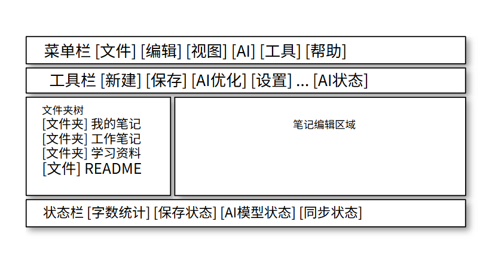
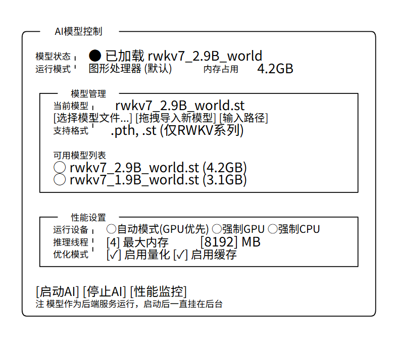

# AI笔记软件 - Windows端产品开发手册

> **版本**: v1.0  
> **创建时间**: 2025年8月28日  
> **文档类型**: Windows端产品规划  
> **负责人**: JolluChen

## 📋 目录导航

- [Windows端概述](#windows端概述)
- [技术方案选型](#技术方案选型)
- [功能规划](#功能规划)
- [技术架构设计](#技术架构设计)
- [开发计划](#开发计划)
- [用户体验设计](#用户体验设计)
- [部署与分发](#部署与分发)

## Windows端概述

### 定位与价值
Windows端作为AI笔记软件的主力产品形态，承担以下核心使命：
- **主要使用场景**: 用户日常笔记记录和管理的主要工具
- **深度集成**: 与Windows系统深度集成，提供原生体验
- **性能优势**: 充分利用本地计算资源，支持大模型本地运行
- **离线优先**: 完全本地化运行，保障数据隐私和离线可用性

### 与Web端的差异化
- **系统集成**: 支持文件拖拽、系统通知、快捷键等原生功能
- **性能表现**: 更好的大文件处理和AI模型运行性能
- **存储管理**: 本地文件系统直接访问和管理
- **用户体验**: 符合Windows用户习惯的界面和交互

## 技术方案选型

### 推荐方案: Electron + React

#### 选择理由
1. **代码复用性**: 直接复用Web端的React组件和业务逻辑
2. **开发效率**: 团队已有React开发经验，学习成本低
3. **跨平台能力**: 为后续Mac版本开发提供基础
4. **生态成熟**: 丰富的插件和工具支持
5. **维护成本**: 与Web端共享大部分代码，降低维护负担

#### 技术栈构成
```
┌─────────────────┐
│   Electron      │  主进程管理、系统API访问
├─────────────────┤
│   React + Vite  │  界面渲染、用户交互
├─────────────────┤
│   Node.js       │  文件操作、进程管理
├─────────────────┤
│   Python后端     │  API服务、AI模型运行
├─────────────────┤
│   SQLite        │  本地数据存储
└─────────────────┘
```

### 替代方案分析

#### 方案二: Tauri + React
**优势**: 更小的包体积，更好的性能  
**劣势**: 生态相对较新，学习成本较高  
**结论**: 暂不采用，但可作为未来优化选项

#### 方案三: .NET WPF/WinUI 3
**优势**: 原生Windows性能和体验  
**劣势**: 无法复用前端代码，需要重新开发界面  
**结论**: 开发成本过高，不符合快速开发要求

## 功能规划

### 核心功能矩阵

| 功能模块 | Web端状态 | Windows端计划 | 优先级 | 预计耗时 |
|---------|----------|---------------|--------|----------|
| 基础笔记编辑 | ✅ 已实现 | 📋 完全复用 | P0 | 1周 |
| 文件夹管理 | ✅ 已实现 | 📋 复用+优化 | P0 | 1周 |
| 拖拽排序 | ✅ 已实现 | 📋 完全复用 | P1 | 3天 |
| AI内容优化 | ✅ 第三方API | 🚀 本地RWKV(后端集成) | P0 | 4周 |
| 富文本编辑 | 🔄 基础实现 | 🚀 完整功能 | P0 | 2周 |
| Mermaid渲染 | ❌ 未实现 | 🚀 新增功能 | P1 | 1周 |
| 文件拖拽 | ❌ 未实现 | 🚀 系统集成 | P1 | 1周 |
| 快捷键支持 | ❌ 未实现 | 🚀 新增功能 | P1 | 1周 |
| 系统托盘 | ❌ 不适用 | 🚀 新增功能 | P2 | 3天 |
| 开机启动 | ❌ 不适用 | 🚀 新增功能 | P2 | 2天 |

### 新增功能规划

#### 1. 本地AI模型集成 (P0)
**目标**: 完全替换第三方AI服务，实现本地RWKV模型运行

**功能需求**:
- [ ] RWKV模型作为后端服务的一部分，启动后一直挂在后台
- [ ] 通过API与RWKV模型交互，与现有后端同层级
- [ ] 模型文件管理界面
- [ ] 拖拽导入模型文件(仅支持RWKV系列.pth, .st)
- [ ] 指定路径导入和路径输入导入
- [ ] 模型加载状态指示
- [ ] 默认GPU模式，无法启动时自动切换到CPU
- [ ] 用户可手动选择GPU/CPU运行模式
- [ ] AI开关控制本地模型启停
- [ ] 模型性能监控面板

**技术实现**:
```javascript
// 主进程: electron/main.js
const { spawn } = require('child_process');

class AIModelManager {
  constructor() {
    this.pythonProcess = null;
    this.modelLoaded = false;
    this.deviceMode = 'gpu'; // 默认GPU模式
    this.autoFallback = true; // 自动回退到CPU
  }
  
  async startPythonBackend() {
    // 启动包含RWKV服务的Python后端
    this.pythonProcess = spawn('python', ['app.py'], {
      cwd: path.join(__dirname, 'backend'),
      env: { ...process.env, RWKV_DEVICE: this.deviceMode }
    });
  }
  
  async loadModel(modelPath) {
    // 调用Python后端加载RWKV模型
    // 仅支持.pth和.st格式
  }
  
  async importModel(filePath, importMethod) {
    // 模型导入：拖拽、路径指定、路径输入
  }
}
```

#### 2. 系统深度集成 (P1)
**目标**: 提供Windows原生应用体验

**功能需求**:
- [ ] 文件关联(.md, .txt等格式)
- [ ] 右键菜单集成("用AI笔记打开")
- [ ] 系统托盘常驻和快速访问
- [ ] 全局快捷键(如Ctrl+Shift+N新建笔记)
- [ ] Windows通知集成
- [ ] 开机自启动选项

#### 3. 增强编辑功能 (P1)
**目标**: 超越Web端的编辑体验

**功能需求**:
- [ ] 本地图片拖拽插入和管理
- [ ] 文件附件拖拽上传
- [ ] 多窗口编辑支持
- [ ] 标签页管理
- [ ] 编辑器主题切换
- [ ] 字体大小快捷调节

#### 4. 性能优化功能 (P2)
**目标**: 充分利用桌面端性能优势

**功能需求**:
- [ ] 大文件快速加载
- [ ] 全文搜索索引优化
- [ ] 历史版本管理
- [ ] 数据库性能监控
- [ ] 内存使用优化

## 技术架构设计

### 整体架构图
```
┌─────────────────────────────────────────────────────┐
│                Electron主进程                        │
│  ├─ 应用生命周期管理                                 │
│  ├─ 窗口管理                                         │
│  ├─ 系统集成(托盘 快捷键 通知)                        │
│  ├─ Python后端进程管理                               │
│  └─ 文件系统访问                                     │
└─────────────────────────────────────────────────────┘
                           │
                    IPC通信 (Inter-Process Communication)
                           │
┌─────────────────────────────────────────────────────┐
│                Electron渲染进程                      │
│  ┌─────────────────────────────────────────────────┐│
│  │              React应用 (复用Web端)                ││
│  │  ├─ NoteEditor (TipTap)                        ││
│  │  ├─ FolderTree                                 ││
│  │  ├─ AIControlPanel                             ││
│  │  ├─ SettingsPanel                              ││
│  │  └─ WindowsSpecificComponents                  ││
│  └─────────────────────────────────────────────────┘│
└─────────────────────────────────────────────────────┘
                           │
                    HTTP API请求
                           │
┌─────────────────────────────────────────────────────┐
│                Python后端服务                       │
│  ├─ Flask API服务器                                 │
│  ├─ SQLite数据库                                   │
│  ├─ RWKV模型服务                                   │
│  └─ 文件管理服务                                   │
└─────────────────────────────────────────────────────┘
```

### 进程通信设计

#### 主进程 ↔ 渲染进程 (IPC)
```javascript
// 主进程: main.js
const { ipcMain } = require('electron');

// 监听渲染进程请求
ipcMain.handle('ai-model-load', async (event, modelPath) => {
  return await aiModelManager.loadModel(modelPath);
});

ipcMain.handle('file-drag-import', async (event, filePath) => {
  return await fileManager.importFile(filePath);
});

// 渲染进程: preload.js
const { contextBridge, ipcRenderer } = require('electron');

contextBridge.exposeInMainWorld('electronAPI', {
  loadAIModel: (modelPath) => ipcRenderer.invoke('ai-model-load', modelPath),
  importFile: (filePath) => ipcRenderer.invoke('file-drag-import', filePath)
});
```

#### 渲染进程 ↔ Python后端 (HTTP)
```javascript
// 复用Web端的API服务
import { apiService } from '../web/src/services/apiService';

// 针对桌面端的增强API
const desktopApiService = {
  ...apiService,
  
  async getAIModelStatus() {
    return await apiService.get('/ai/model/status');
  },
  
  async loadAIModel(modelPath) {
    return await apiService.post('/ai/model/load', { path: modelPath });
  }
};
```

### 文件结构设计
```
Win/
├── electron/                    # Electron主进程代码
│   ├── main.js                 # 应用入口
│   ├── preload.js              # 预加载脚本
│   ├── ai-manager.js           # AI模型管理
│   ├── file-manager.js         # 文件管理
│   └── window-manager.js       # 窗口管理
├── src/                        # 渲染进程代码(React)
│   ├── components/             # Windows特有组件
│   │   ├── AIModelPanel.jsx    # AI模型控制面板
│   │   ├── SystemTrayMenu.jsx  # 系统托盘菜单
│   │   ├── SettingsDialog.jsx  # 设置对话框
│   │   └── FileDragZone.jsx    # 文件拖拽区域
│   ├── hooks/                  # Windows特有Hooks
│   │   ├── useSystemIntegration.js
│   │   ├── useAIModel.js
│   │   └── useFileImport.js
│   ├── services/               # 桌面端API服务
│   │   ├── electronAPI.js      # Electron API封装
│   │   └── desktopApiService.js
│   └── utils/                  # 工具函数
│       ├── pathUtils.js
│       └── systemUtils.js
├── backend/                    # Python后端(软链接到Web/app)
├── build/                      # 构建配置
│   ├── webpack.config.js
│   └── electron-builder.yml    # 打包配置
├── dist/                       # 构建输出
├── package.json               # 项目配置
└── README.md                  # 开发说明
```

## 开发计划

### 第一阶段: 基础框架搭建 (2-3周)

#### Week 1: Electron项目初始化
**目标**: 搭建基础开发环境
- [ ] Electron + React + Vite项目搭建
- [ ] 开发环境配置(热重载、调试)
- [ ] 基础窗口管理和菜单
- [ ] IPC通信框架搭建

**技术任务**:
```bash
# 项目初始化
npm create electron-app ai-notes-win
cd ai-notes-win
npm install react react-dom @vitejs/plugin-react
npm install -D electron-builder concurrently wait-on
```

#### Week 2: Web端代码移植
**目标**: 复用Web端React组件
- [ ] 复制Web端src目录结构
- [ ] 适配Electron环境的API调用
- [ ] 基础编辑器功能验证
- [ ] 样式和主题适配

#### Week 3: Python后端集成
**目标**: 集成现有Flask后端
- [ ] Python环境管理(pyinstaller打包)
- [ ] 后端进程启动和管理
- [ ] API连接测试
- [ ] 数据库文件路径管理

### 第二阶段: 核心功能实现 (4-5周)

#### Week 4-6: AI模型本地化
**目标**: 实现本地RWKV模型集成
- [ ] RWKV模型作为后端服务集成
- [ ] 模型启动后一直挂在后台，通过API交互
- [ ] RWKV模型加载接口开发(仅支持.pth, .st格式)
- [ ] 模型文件拖拽导入、路径指定、路径输入功能
- [ ] 默认GPU模式，自动切换到CPU逻辑
- [ ] 用户手动选择GPU/CPU模式
- [ ] AI控制面板UI开发
- [ ] 模型状态监控和错误处理

#### Week 7-8: 系统集成功能
**目标**: Windows系统深度集成
- [ ] 系统托盘功能实现
- [ ] 全局快捷键注册
- [ ] 文件关联和右键菜单
- [ ] 开机启动选项

#### Week 9: 增强编辑功能
**目标**: 桌面端特有编辑体验
- [ ] 文件拖拽导入功能
- [ ] 多窗口支持
- [ ] Mermaid图表渲染
- [ ] 本地图片管理

### 第三阶段: 优化和测试 (2-3周)

#### Week 10-11: 性能优化
**目标**: 提升应用性能和稳定性
- [ ] 内存使用优化
- [ ] 启动速度优化
- [ ] 大文件处理优化
- [ ] AI模型性能调优

#### Week 12: 测试和打包
**目标**: 完成应用打包和发布准备
- [ ] 功能完整性测试
- [ ] 不同Windows版本兼容性测试
- [ ] 安装包打包配置
- [ ] 自动更新机制

## 用户体验设计

### 界面设计原则
- **一致性**: 与Web端保持视觉和交互一致性
- **原生感**: 符合Windows应用的设计语言
- **效率优先**: 快捷键和右键菜单丰富
- **可定制**: 支持主题、字体等个性化设置

### 关键界面设计

#### 主窗口布局
```
┌────────────────────────────────────────────────────┐
│ 菜单栏 [文件] [编辑] [视图] [AI] [工具] [帮助]      │
├────────────────────────────────────────────────────┤
│ 工具栏 [新建] [保存] [AI优化] [设置] ... [AI状态]   │
├─────────────┬──────────────────────────────────────┤
│ 文件夹树     │                                     │
│ 📁 我的笔记  │           笔记编辑区域                │
│ 📁 工作笔记  │                                     │
│ 📁 学习资料  │                                     │
│ 📄 README   │                                     │
│             │                                     │
└─────────────┴──────────────────────────────────────┘
│ 状态栏 [字数统计] [保存状态] [AI模型状态] [同步状态] │
└────────────────────────────────────────────────────┘
```




#### AI控制面板
```
┌─ AI模型控制 ──────────────────────────────────────┐
│                                                   │
│ 模型状态: ● 已加载 RWKV-4-World-CHNtuned          │
│ 运行模式: 🖥️ GPU (默认)   内存占用: 4.2GB        │
│                                                   │
│ ┌─ 模型管理 ─────────────────────────────────────┐ │
│ │ 当前模型: RWKV-4-World-CHNtuned.pth           │ │
│ │ [选择模型文件...] [拖拽导入新模型] [输入路径]   │ │
│ │ 支持格式: .pth, .st (仅RWKV系列)              │ │
│ │                                               │ │
│ │ 可用模型列表:                                  │ │
│ │ ○ RWKV-4-World-CHNtuned.pth (4.2GB)         │ │
│ │ ○ RWKV-6-World-3B.st (3.1GB)                │ │
│ └───────────────────────────────────────────────┘ │
│                                                   │
│ ┌─ 性能设置 ─────────────────────────────────────┐ │
│ │ 运行设备: ○ 自动模式(GPU优先) ○ 强制GPU ○ 强制CPU │ │
│ │ 推理线程: [4] 最大内存: [8192] MB              │ │
│ │ 优化模式: ☑️ 启用量化 ☑️ 启用缓存              │ │
│ └───────────────────────────────────────────────┘ │
│                                                   │
│ [启动AI] [停止AI] [性能监控]                      │
│ 注: 模型作为后端服务运行，启动后一直挂在后台        │
└───────────────────────────────────────────────────┘
```



### 交互体验设计

#### 快捷键体系
```
# 通用快捷键
Ctrl + N         新建笔记
Ctrl + S         保存当前笔记
Ctrl + F         搜索笔记内容
Ctrl + Shift + F 全局搜索

# AI功能快捷键
Ctrl + G         AI优化当前选中内容
Ctrl + Shift + G AI优化整篇笔记
F4               切换AI开关状态

# 窗口管理
Ctrl + T         新建标签页
Ctrl + W         关闭当前标签页
Ctrl + Tab       切换标签页
F11              全屏模式

# 系统集成
Ctrl + Shift + N 全局新建笔记(后台运行时)
```

#### 拖拽交互
- **文件拖拽**: 支持从资源管理器拖拽文件到笔记中
- **图片拖拽**: 自动处理图片格式转换和存储
- **模型拖拽**: 拖拽.pth/.st文件到AI面板自动导入
- **笔记拖拽**: 在文件夹间拖拽移动笔记

## 部署与分发

### 打包配置

#### Electron Builder配置
```yaml
# build/electron-builder.yml
appId: com.jellol.ainotes
productName: AI笔记软件
directories:
  buildResources: build
  output: dist
files:
  - "!**/.vscode/*"
  - "!src/*"
  - "!electron.vite.config.*"
  - "!{.eslintignore,.eslintrc.cjs,.prettierignore,.prettierrc.yaml,dev-app-update.yml,CHANGELOG.md,README.md}"
  - "!{.env,.env.*,.npmrc,pnpm-lock.yaml}"
asarUnpack:
  - resources/**
  - backend/**
win:
  executableName: AI笔记软件
  target:
    - target: nsis
      arch:
        - x64
        - ia32
  icon: assets/icon.ico
nsis:
  oneClick: false
  allowToChangeInstallationDirectory: true
  allowElevation: true
  installerIcon: assets/installer.ico
  uninstallerIcon: assets/uninstaller.ico
  installerHeaderIcon: assets/installer-header.ico
  createDesktopShortcut: always
  createStartMenuShortcut: true
  shortcutName: AI笔记软件
```

### 分发策略

#### 安装包类型
1. **完整安装包**: 包含Python环境和依赖
2. **精简安装包**: 要求用户预装Python环境
3. **便携版**: 免安装的绿色版本

#### 更新机制
```javascript
// 自动更新配置
const { autoUpdater } = require('electron-updater');

autoUpdater.checkForUpdatesAndNotify();

autoUpdater.on('update-available', () => {
  // 通知用户有新版本
});

autoUpdater.on('update-downloaded', () => {
  // 提示用户重启应用
});
```

### 性能基准

#### 启动性能目标
- 冷启动时间: < 3秒
- 界面渲染时间: < 1秒
- AI模型加载时间: < 10秒

#### 资源使用目标
- 空闲内存占用: < 200MB
- AI模型运行时内存: < 8GB
- 安装包大小: < 500MB

---

**备注**: 本开发手册将根据实际开发进度和技术验证结果进行调整。建议在开发过程中定期与项目负责人确认技术方案和功能优先级。
